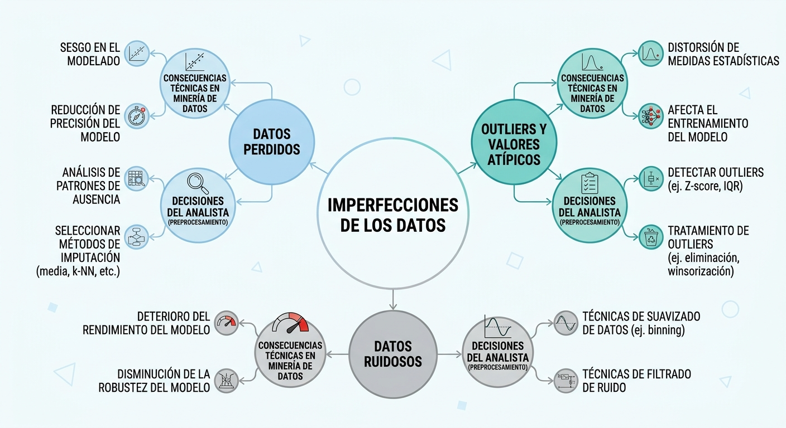
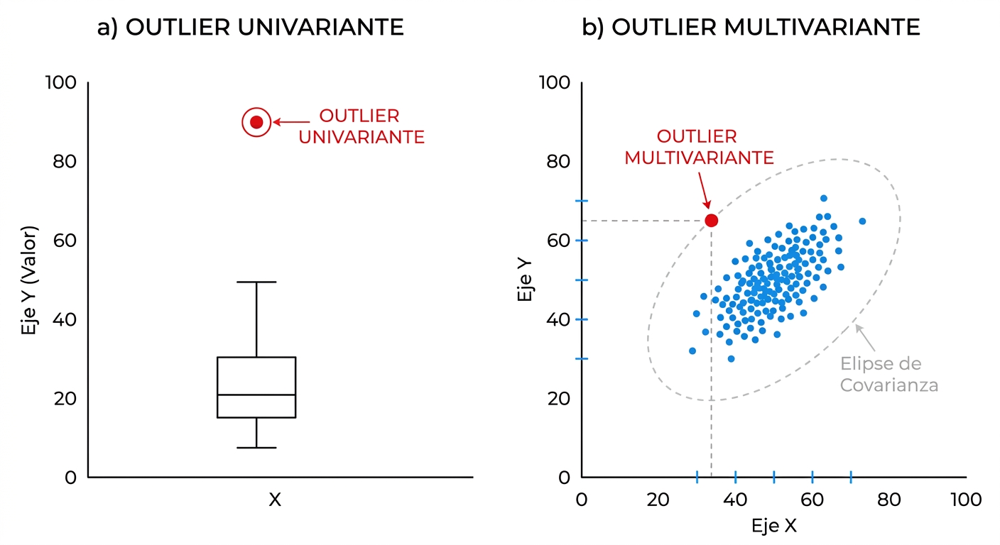

# Detección y Tratamiento de Anomalías: Valores Perdidos y Atípicos

## La Filosofía de las Anomalías en Minería de Datos

En el análisis de datos del mundo real, la presencia de anomalías e imperfecciones es una regla y no una excepción. Como señala el estadístico David J. Hand, "debemos desconfiar de cualquier conjunto de datos (grande o pequeño) que parezca perfecto", ya que la limpieza absoluta suele ocultar problemas de recolección o preprocesamiento inadecuado [@torgo2017]. El analista debe comprender que **la falta de información es información**, y que el comportamiento inusual de una variable puede revelar patrones estratégicos cruciales, como fraudes o fallas de sistema, si se examina con el rigor metodológico apropiado [@torgo2017].

En el marco del proceso de Descubrimiento de Conocimiento (KDD), las anomalías se dividen principalmente en dos grandes categorías: **valores perdidos** (*missing values*), que representan la ausencia física de mediciones en ciertos atributos [@torgo2017], y **valores atípicos** (*outliers*), que son observaciones que se desvían de manera extrema de los patrones de variabilidad del resto del conjunto [@tan2019]. Tratar estas imperfecciones de forma mecánica sin evaluar su origen introduce sesgos que invalidan cualquier modelado algorítmico posterior [@shmueli2018].



## Detección y Tratamiento de Valores Atípicos (Outliers)

Un valor atípico es una observación que presenta una desviación extrema respecto al patrón general de variabilidad observado en el conjunto de datos [@tan2019]. La investigación de outliers exige distinguir rigurosamente entre anomalías univariantes y multivariantes [@johnson2014].

### Enfoque Univariante: Detección y Mitigación

El análisis univariante examina el comportamiento de los atributos de forma aislada, sin considerar sus interrelaciones [@johnson2014].

#### Métodos de Detección

*   **Regla del Rango Intercuartílico (IQR):** Define límites de control basados en la dispersión robusta de los datos. El rango intercuartílico es $IQR = Q3 - Q1$ [@tan2019]. Los límites inferior y superior se establecen como:
$$[\text{Límite Inferior}, \text{Límite Superior}] = [Q1 - 1.5 \times IQR, \quad Q3 + 1.5 \times IQR]$$
*   **Test Estadístico de Grubbs:** Evalúa la hipótesis nula de que no existen outliers en una variable distribuida normalmente, detectando si el valor más alejado de la media representa una desviación estadísticamente significativa.

::: {.panel-tabset}

### Z-Score / Puntaje Normalizado

Mide la distancia estandarizada de cada observación respecto a la media muestral ($\bar{x}$) en unidades de desviación estándar ($s$).

**Fórmula:**
$$z_i = \frac{x_i - \bar{x}}{s}$$

* **$\bar{x}$**: Media muestral.
* **$s$**: Desviación estándar muestral.

### Puntuación t-Student

Transforma el Z-score a una escala basada en la distribución $t$ de Student con $n-2$ grados de libertad.

**Fórmula:**
$$t_i = \frac{z_i \sqrt{n-2}}{\sqrt{n - 1 - z_i^2}}$$

* **$z_i$**: Z-score de la observación $i$.
* **$n$**: Tamaña de la muestra.

### Puntuación Chi-Cuadrado

Calcula la distancia al cuadrado respecto a la media dividida por la varianza muestral ($s^2$). Es equivalente a elevar al cuadrado el Z-score.

**Fórmula:**
$$\chi^2_i = \frac{(x_i - \bar{x})^2}{s^2} = z_i^2$$

### Rango Intercuartílico

Mide la distancia de los valores que caen fuera de los cuartiles $Q_1$ o $Q_3$, normalizada por el rango intercuartílico ($IQR$). Si el dato está dentro del rango intercuartílico, la puntuación es cero.

**Fórmula:**
$$S_i = \begin{cases} \frac{Q_1 - x_i}{IQR} & \text{si } x_i < Q_1 \\ 0 & \text{si } Q_1 \le x_i \le Q_3 \\ \frac{x_i - Q_3}{IQR} & \text{si } x_i > Q_3 \end{cases}$$

* **$IQR$**: $Q_3 - Q_1$ (Rango Intercuartílico).

### Desviación Absoluta Mediana (Medida Robusta)

Una alternativa robusta al Z-score que sustituye la media por la mediana y la desviación estándar por la MAD, haciéndola inmune al impacto de los propios datos atípicos.

**Fórmula:**
$$\text{Score}_i = \frac{x_i - \tilde{x}}{\text{MAD}(x)}$$

Donde:

* **$\tilde{x}$**: Mediana de los datos, $\text{mediana}(x)$.
* **$\text{MAD}(x)$**: $1.4826 \cdot \text{mediana}(|x_i - \tilde{x}|)$
  *(El factor $1.4826$ ajusta la escala para aproximarse a la desviación estándar de una distribución normal).*

:::

#### Prácticas Comunes de Solución

*   **Tratamiento de Recorte (*Trimming*):** Eliminar físicamente las observaciones identificadas como outliers univariantes. Se recomienda únicamente si la anomalía es un error de medición irreversible.
*   **Winsorización:** Reemplazar los valores extremos que superan los límites de percentiles establecidos por los valores límite de dichos percentiles, preservando el tamaño original del dataset.
*   **Transformaciones Matemáticas:** Aplicar funciones como el logaritmo natural ($\log(x)$) para comprimir la escala de los valores extremadamente altos, reduciendo la asimetría de la distribución [@tan2019].

### Enfoque Multivariante: La Dimensión Compleja

Un registro puede poseer valores perfectamente típicos si se examinan sus variables de forma aislada, pero representar una anomalía severa cuando se analiza el comportamiento conjunto de todos sus atributos [@johnson2014].



#### Visualización Avanzada: matplot y Chernoff

Para diagnosticar anomalías multivariantes de manera intuitiva, el analista puede recurrir a representaciones gráficas especializadas de alta dimensionalidad [@johnson2014]:

*   **Gráficos de Perfiles con `matplot()`:** Permiten trazar las observaciones como líneas quebradas a lo largo de los ejes de las variables del dataset, facilitando la identificación de registros que poseen perfiles o tendencias contradictorias respecto al comportamiento general.
*   **Caras de Chernoff:** Mapean atributos cuantitativos a rasgos faciales (forma de la cara, tamaño de los ojos, curvatura de la boca) [@johnson2014]. Permite al ojo humano reconocer de inmediato rostros con expresiones extrañas o aberrantes que representan outliers complejos [@johnson2014].

::: {.panel-tabset}

### Perfiles Paralelos con `matplot`
Uso de gráficos de perfil paralelos sobre las variables continuas del dataset iris:
```r
# Seleccionar y estandarizar las columnas numéricas de iris
datos_iris_m <- scale(iris[, 1:4])

# Configurar un gráfico de perfil paralelo
matplot(t(datos_iris_m), type = "l", lty = 1, col = rgb(0, 0, 0, 0.15),
        xlab = "Variables Continuas", ylab = "Valores Estandarizados",
        main = "Gráfico de Perfil Multivariante (Iris)")
```

### Rostros de Chernoff (`aplpack`)
Representación gráfica icónica utilizando el paquete especializado `aplpack`:
```r
# Instalar y cargar librería aplpack si no está disponible
library(aplpack)

# Tomar una muestra representativa de observaciones
muestra_caras <- iris[c(1:5, 51:55, 101:105), 1:4]

# Dibujar caras de Chernoff mapeando variables numéricas a rasgos faciales
faces(muestra_caras, face.type = 1, 
      main = "Rostros de Chernoff: Identificación Visual de Outliers")
```
:::

#### Test multivariantes

- Algoritmo BACON   
- Local Outlier Factor 

#### Listado de Enfoques Avanzados de Detección Multivariante

Los siguientes métodos algorítmicos serán desarrollados en profundidad en los capítulos correspondientes de modelado no supervisado:
*   **Análisis de Componentes Principales (PCA):** Detección basada en las puntuaciones de las primeras componentes (outliers estructurales) o de las últimas componentes (violaciones a las correlaciones lineales) .
*   **Algoritmo DBSCAN:** Identificación de outliers basados en densidad de vecindad.
*   **Local Outlier Factor (LOF):** Enfoque basado en el cálculo de densidad local relativa respecto a la densidad de su entorno cercano.

::: {.callout-important}
### Actividad de Clase: El Impacto de la Escala en Outliers (10 min)
**Contexto:** Un analista de riesgos desea detectar fraudes en transacciones utilizando dos atributos: "Monto de Retiro" (escala de 0 a 5,000 BOB) y "Cantidad de Retiros Diarios" (escala de 0 a 10).

**Instrucción:** Analice la situación y responda:

1.  Si un usuario realiza un retiro inusual de 4,500 BOB (cerca del límite univariante), ¿por qué este registro podría ocultar un fraude multivariante si no evaluamos su correlación con la cantidad de retiros realizados en la última hora?.
2.  ¿Por qué la distancia euclidiana simple fallaría en detectar anomalías en este escenario si no escalamos previamente ambas variables?.
:::

## Tratamiento de Valores Perdidos (Missing Data)

### Aproximación Formal e Identificación de Mecanismos

Para estructurar matemáticamente el problema de los datos incompletos, definimos una base de datos como una matriz $Y$ de dimensiones $n \times p$ [@torgo2017]. Sea $R$ una matriz de respuesta binaria de dimensiones idénticas, donde cada elemento $r_{ij} = 1$ si el valor de la variable $y_{ij}$ fue observado, y $r_{ij} = 0$ si es un dato perdido [@torgo2017]. Los valores observados se agrupan en el conjunto $Y_{obs}$, mientras que los registros omitidos se denotan como $Y_{mis}$, de modo que $Y = (Y_{obs}, Y_{mis})$ [@torgo2017].

La probabilidad de pérdida de datos se modela bajo una distribución condicional parametrizada por $\psi$, expresada como $\Pr(R \mid Y_{obs}, Y_{mis}, \psi)$ [@torgo2017]. Basándonos en esta formulación, clasificamos los procesos de pérdida en tres mecanismos fundamentales:

1.  **Pérdida Completamente al Azar (MCAR - Missing Completely at Random):** La probabilidad de que un dato se pierda es totalmente independiente de los valores de las variables (sean observadas o perdidas) [@torgo2017].
    $$\Pr(R = 0 \mid Y_{obs}, Y_{mis}, \psi) = \Pr(R = 0 \mid \psi)$$
2.  **Pérdida al Azar (MAR - Missing at Random):** La probabilidad de pérdida no depende de los valores omitidos $Y_{mis}$, pero sí puede explicarse por completo a través de otras variables observadas en el dataset ($Y_{obs}$) [@torgo2017].
    $$\Pr(R = 0 \mid Y_{obs}, Y_{mis}, \psi) = \Pr(R = 0 \mid Y_{obs}, \psi)$$
3.  **Pérdida No al Azar (MNAR - Missing Not at Random):** La probabilidad de que un registro sea omitido depende directamente del valor que hubiese tomado la variable no observada [@torgo2017]. Es un mecanismo no ignorable que requiere un modelado explícito de la causa de pérdida.
    $$\Pr(R = 0 \mid Y_{obs}, Y_{mis}, \psi)$$

### Diagnóstico de Patrones de Pérdida con R (`mice`)

Antes de seleccionar una estrategia de imputación, es recomendable aplicar pruebas de diagnóstico visual y estadístico para entender la estructura de la pérdida. El paquete **`mice`** (Multivariate Imputation by Chained Equations) proporciona herramientas potentes para examinar la distribución de los datos faltantes.

La función `md.pattern()` permite visualizar y retornar la matriz de patrones de pérdida, mostrando qué combinaciones de variables faltantes se presentan con mayor frecuencia y cómo se agrupan las observaciones incompletas.

```r
library(mice)
library(DMwR2)
data(algae, package="DMwR2")

# Visualizar el patrón de datos perdidos para las variables químicas
patron_perdidos <- md.pattern(algae[, 4:11], plot = TRUE, rotate.names = TRUE)
```

> **Sugerencia de Imagen:** Una captura o representación del gráfico de salida de `md.pattern()`, mostrando en el eje vertical el número de filas con combinaciones específicas de valores perdidos, y en el eje horizontal las variables ordenadas por su nivel de completitud.

---

### Conectividad de la Pérdida: Influx y Outflux

Para evaluar la viabilidad de la imputación en un dataset multivariado, se emplean los coeficientes de **Influx** ($I_j$) y **Outflux** ($O_j$) desarrollados por van Buuren [@torgo2017]. Estas métricas cuantifican la fuerza de conexión de cada variable dentro del sistema de datos faltantes:

*   **Influx ($I_j$):** Mide qué tan bien conectada está una variable incompleta con los datos observados de las demás variables [@torgo2017]. Una variable con mayor $I_j$ es más fácil de imputar debido a que cuenta con un fuerte respaldo de datos observados en su vecindad algorítmica.
    $$I_j = \frac{\sum_j^p\sum_k^p\sum_i^n (1-r_{ij})r_{ik}}{\sum_k^p\sum_i^n r_{ik}}$$
*   **Outflux ($O_j$):** Cuantifica la utilidad de una variable para servir como predictora en los modelos de imputación de otras variables faltantes [@torgo2017]. Una variable con alto $O_j$ es un activo predictivo valioso dentro del flujo de trabajo de imputación múltiple.
    $$O_j = \frac{\sum_j^p\sum_k^p\sum_i^n r_{ij}(1-r_{ik})}{\sum_k^p\sum_i^n 1-r_{ij}}$$

::: {.panel-tabset}

### Cálculo de Influx/Outflux en R
El cálculo y visualización de estas métricas se realiza de manera directa utilizando la función `flux()` del paquete `mice`:
```r
library(mice)

# Calcular métricas de flujo sobre las columnas con variables continuas
estadisticas_flujo <- flux(algae[, 4:11])

# Mostrar la tabla de resultados (influx, outflux, proporción de missings)
print(estadisticas_flujo)
```

### Gráfico de Diagnóstico de Flujo
Es posible generar un "fluxplot" para posicionar visualmente cada variable en función de su Influx y Outflux, facilitando la toma de decisiones sobre qué variables retener o priorizar en los modelos:
```r
# Graficar el flujo de datos faltantes
fluxplot(algae[, 4:11], main = "Gráfico de Diagnóstico de Influx y Outflux")
```
:::

---

::: {.callout-note}
### Actividad de Clase 1: Análisis de Conectividad (10 min)
**Escenario:** Imagine que un dataset bancario muestra que la variable "Historial de Pagos" posee un alto Influx ($I_j \approx 0.85$) pero un bajo Outflux ($O_j \approx 0.12$), mientras que la variable "Nivel de Ingresos" muestra la tendencia opuesta.
1.  **Pregunta:** ¿Cuál de las dos variables será más fácil de imputar con alta precisión?
2.  **Pregunta:** Si planea construir modelos predictivos para estimar otras variables del dataset, ¿cuál de las dos variables aportará mayor estabilidad y poder predictor para las imputaciones? [@torgo2017].
:::

---

### Técnicas de Imputación Clásicas (Ad-Hoc)

La literatura estadística clásica provee soluciones directas de fácil implementación computacional, las cuales resultan idóneas en este punto del curso debido a que no exigen el entrenamiento de modelos de machine learning avanzados:

*   **Eliminación por Filas (*Listwise Deletion*):** Consiste en descartar por completo cualquier observación que contenga al menos un valor perdido [@torgo2017]. Solo es metodológicamente válida si el mecanismo es estrictamente MCAR y el tamaño de la pérdida es insignificante.
*   **Imputación por Tendencia Central (Media o Mediana):** Reemplaza las celdas vacías por la media o mediana de la parte observada de la misma variable [@torgo2017]. Su gran riesgo es que reduce artificialmente la varianza de la variable, distorsionando la estructura estadística original [@shmueli2018].
*   **Imputación por Regresión Simple:** Construye un modelo lineal clásico (`lm()`) donde la variable con datos perdidos actúa como variable objetivo y se predice a partir de variables observadas completas [@torgo2017].

```r
# 1. Eliminación por filas usando R base
algae_completos <- na.omit(algae)

# 2. Imputación simple por mediana
algae_mediana <- algae
algae_mediana$mxPH[is.na(algae_mediana$mxPH)] <- median(algae_mediana$mxPH, na.rm = TRUE)

# 3. Imputación por regresión predictiva simple
modelo_lineal <- lm(PO4 ~ oPO4, data = algae)
algae$PO4[is.na(algae$PO4)] <- predict(modelo_lineal, newdata = algae[is.na(algae$PO4), ])
```

### Listado Conceptual de Métodos de Imputación Avanzados

Las técnicas basadas en machine learning se abordarán en detalle en las siguientes secciones del libro. Conceptualice los siguientes métodos como extensiones de este capítulo:
*   **Imputación No Supervisada por Vecinos Cercanos (k-NN):** Estima el valor perdido calculando la media ponderada de los $k$ registros geométricamente más similares [@torgo2017].
*   **Regresión Estocástica:** Reintroduce la variabilidad natural sumando un término de ruido aleatorio ($\epsilon \sim N(0, \sigma^2)$) extraído de los residuos de la regresión [@torgo2017].
*   **Imputación Múltiple (MICE):** Genera múltiples datasets imputados combinando ecuaciones totalmente condicionales, permitiendo modelar la incertidumbre de la imputación de manera formal.

::: {.callout-tip}
### Bloque de Ejercicios: Diagnóstico y Tratamiento de Anomalías

1.  **Diagnóstico Visual de Datos Perdidos:** Cargue las variables numéricas del dataset `algae` de `DMwR2`. Utilice el comando `md.pattern()` del paquete `mice` para extraer la matriz de patrones de datos perdidos y responda:
    a) ¿Cuántas observaciones completas (*complete cases*) registra el dataset? [@torgo2017].
    b) ¿Qué combinación o patrón de variables faltantes se presenta con mayor frecuencia?
2.  **Cálculo Analítico de Flujo con mice:** Utilizando las variables continuas de `algae`:
    a) Ejecute el cálculo de flujo con `mice::flux()`.
    b) Identifique las variables con el mayor **Influx** y el mayor **Outflux** [@torgo2017].
    c) Interprete cuál de las variables continuas es el mejor candidato predictor para entrenar modelos de imputación y cuál se beneficiaría más de la imputación basada en la vecindad.
3.  **Análisis Multivariante con Mahalanobis:** Utilice las primeras 4 variables numéricas del dataset `iris` para resolver:
    a) Calcule la distancia de Mahalanobis para cada una de las 150 observaciones del dataset utilizando la función `mahalanobis()` de R base [@johnson2014].
    b) Construya un gráfico Chi-cuadrado ordenando las distancias calculadas frente a los percentiles teóricos de una distribución $\chi^2_4$ [@johnson2014].
    c) Identifique visual y analíticamente el número de fila que más se desvía de la línea de normalidad, considerándolo un outlier multivariante sospechoso [@johnson2014].
:::
