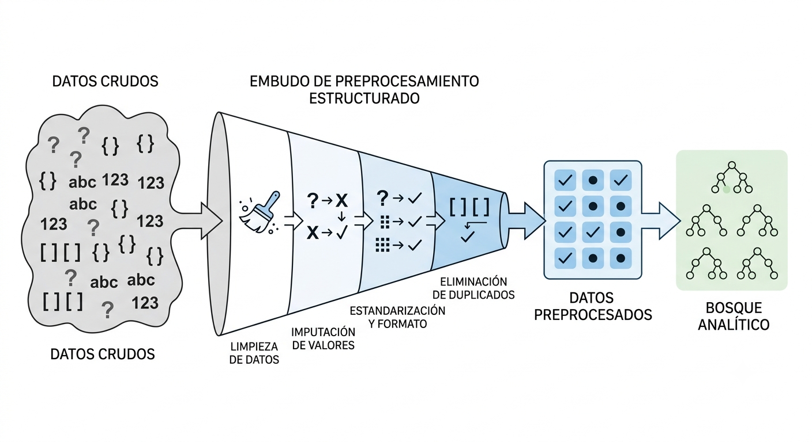

# Calidad del Dato y Preparación Inicial

## Introducción a la Calidad del Dato

El preprocesamiento de datos es una de las fases más complejas, laboriosas y determinantes en cualquier proyecto de minería de datos. En la práctica profesional de la Inteligencia de Negocios, se estima que las tareas de preparación, limpieza y transformación consumen entre el 60% y el 80% del esfuerzo y tiempo total del equipo analítico [@chapman2000]. Este proceso requiere una combinación de criterio metodológico, conocimiento del negocio y paciencia para interactuar con distintas áreas organizacionales, garantizando que los datos de entrada sean aptos para el modelado algorítmico.

Un principio rector en esta etapa es entender que, en la minería de datos, **la no información también es información**. La presencia sistemática de valores perdidos, registros vacíos o inconsistencias no debe tratarse simplemente como "ruido" que se elimina de inmediato, sino como un síntoma del proceso de generación de datos que puede aportar información relevante sobre fallas operativas o perfiles específicos de clientes. Así, una base de datos depurada y bien probada en calidad constituye el cimiento indispensable para evitar el fenómeno de *garbage in, garbage out* en el entrenamiento de modelos predictivos o descriptivos [@tan2019].



## Dimensiones de la Calidad de los Datos

Para certificar que un conjunto de datos es apto para un proceso de modelado, el analista debe evaluar la información bajo cinco dimensiones de calidad esenciales:

*   **Precisión (*Accuracy*):** Evalúa qué tan cercanos están los valores registrados en el dataset respecto a los valores reales del fenómeno físico o económico estudiado [@tan2019].
*   **Integridad (*Completeness*):** Analiza la presencia o ausencia de registros vacíos y valores perdidos. Determina si el dataset cuenta con todos los atributos necesarios para responder la pregunta de negocio.
*   **Consistencia (*Consistency*):** Verifica la coherencia interna de los datos (por ejemplo, que la fecha de desembolso de un crédito no sea anterior a la fecha de solicitud, o que los saldos y cuentas sean lógicos entre sí).
*   **Puntualidad (*Timeliness*):** Mide qué tan actualizada está la información respecto al momento en que se ejecuta el análisis y se toman las decisiones estratégicas.
*   **Accesibilidad (*Accessibility*):** Garantiza que los analistas puedan extraer y procesar las variables bajo condiciones técnicas viables, seguras y reproducibles.

::: {.callout-note}
### Actividad: Diagnóstico Inicial (5 min)
**Escenario de Negocio:** Una cooperativa de ahorro y crédito en Bolivia decide consolidar su base de solicitudes de microcrédito. Al realizar una exploración rápida, se detectan tres situaciones:

1.  La columna de "Edad" tiene registros con valores de `250` años y `-5` años.
2.  La columna "Cédula de Identidad" presenta duplicados exactos en transacciones que ocurrieron en la misma fecha y hora.
3.  El campo "Ingreso Mensual" tiene un carácter de interrogación (`?`) para el 35% de los clientes independientes.

**Instrucción:** Identifique a qué dimensión de la calidad del dato afecta cada uno de los problemas descritos y comente conceptualmente cómo la premisa de que "la no información es información" se aplica al análisis del 35% de los clientes independientes que no reportaron ingresos.
:::

## Metadata y el Diccionario de Variables

La ingesta y exploración inicial de un dataset no puede ejecutarse a ciegas; requiere el acompañamiento de su **metadata** (datos sobre los datos) para contextualizar el alcance del análisis. De acuerdo con las mejores prácticas de documentación de microdatos, la metadata técnica debe registrar los siguientes elementos estructurales:

*   **Población Objetivo:** El universo o conjunto de elementos sobre los cuales se desea realizar inferencias (por ejemplo, hogares bolivianos o transacciones activas de tarjetas de crédito).
*   **Unidad de Análisis:** El objeto individual sobre el cual se recolecta la información (ej. la persona, la empresa o el municipio).
*   **Unidad de Información:** El informante que reporta los datos (ej. el jefe de hogar en una encuesta de pobreza).
*   **Unidades Agregadas:** Niveles de consolidación de datos (ej. agregación municipal o departamental).
*   **Cobertura Espacial y Temporal:** Delimitación geográfica y el período exacto de tiempo que abarcan las observaciones.
*   **Diseño Estadístico:** Especificación de si el dataset proviene de un censo completo, un muestreo probabilístico o un registro transaccional.

Asociado a esto, el **Diccionario de Variables** detalla las propiedades específicas de cada columna del dataset, permitiendo clasificar de inmediato las variables en **cualitativas** (nominales u ordinales) y **cuantitativas** (discretas o continuas) para aplicar los tratamientos estadísticos y visuales metodológicamente correctos.

## Ingesta de Datos y Exploración Inicial

El flujo técnico de preparación de datos inicia con la importación del dataset externo al entorno de computación estadística de preferencia (R) [@torgo2017]. El primer paso es identificar el formato de origen (ej. archivos planos, hojas de cálculo o archivos de software estadístico comercial).

> Note: El scraping web o el consumo API son otras alternativas de esta ingesta de datos

::: {.panel-tabset}

### Formatos Comunes y Lectura
R proporciona un ecosistema robusto de librerías para la ingesta eficiente de datos:

*   **Archivos Planos (`.csv`, `.txt`):** Se importan mediante la librería `readr` utilizando funciones como `read_csv()` o `read_delim()`.
*   **Hojas de Cálculo (`.xlsx`, `.xls`):** Se procesan a través de la librería `readxl` con la función `read_excel()`.
*   **Microdatos de Software Estadístico (`.sav` de SPSS, `.dta` de Stata):** Se leen mediante la librería `haven` con funciones como `read_sav()` y `read_dta()`.

### Comandos de Diagnóstico Inicial
Una vez leída la base de datos en memoria, es imperativo realizar un reconocimiento inicial de sus dimensiones y tipos de datos:
```r
library(dplyr)

# 1. Dimensiones de la base de datos (Filas y Columnas)
dim(df_clientes)

# 2. Estructura y tipos de atributos (clases de objetos)
str(df_clientes)

# 3. Vista preliminar de los primeros registros
head(df_clientes, n = 5)

# 4. Resumen estadístico univariado
summary(df_clientes)
```

### Optimización y Selección
Para liberar memoria física de la computadora y optimizar los tiempos de procesamiento en grandes conjuntos de datos, se recomienda realizar la **selección de variables** en las etapas iniciales del flujo, eliminando columnas irrelevantes para el modelo de minería de datos:
```r
# Seleccionar únicamente las variables requeridas para el análisis
df_reducido <- df_clientes %>%
  select(ci, monto_solicitado, estado_civil, ingresos)
```
:::

::: {.callout-note}
### Actividad grupal:
Examine los siguientes requerimientos, descargue el fichero disponible, impórtelo a R, cree objetos `.RData` y construya los metadatos correspondientes para un solo caso:

* Resultados del Censo de Población y Vivienda 2024 para el departamento de Oruro
* Última encuesta a hogares disponible
* Resultados a nivel de mesa de la última elección presidencial
* Información sobre bancarización en Bolivia
* Cartografía actualizada de los municipios de Bolivia
* Importaciones y exportaciones de Bolivia para 2026 a nivel de transacciones
:::

## Limpieza de Texto y Estandarización de Variables

Las variables que almacenan cadenas de caracteres (*strings*) suelen ser las más ruidosas debido a errores de transcripción, uso inconsistente de mayúsculas/minúsculas y la presencia de espacios en blanco redundantes. Para estandarizar estas columnas, se recomienda aplicar un flujo de limpieza sistemático:

1.  **Homogeneidad de Caja:** Trabajar todo el texto estrictamente en mayúsculas o en minúsculas para evitar duplicidades categóricas (ej. que R trate a "La Paz", "la paz" y "LA PAZ" como tres categorías diferentes).
2.  **Eliminación de Espacios Redundantes:** Controlar y limpiar los espacios en blanco adicionales al inicio, al final o entre palabras (ej. corregir "El  Alto" a "El Alto").
3.  **Control de Caracteres Extraños:** Depurar acentos, eñes (`ñ`) o símbolos especiales que puedan corromper la codificación del archivo al renderizar reportes dinámicos.

```r
library(dplyr)
library(stringr)

# Ejemplo de limpieza de texto en variables de categorías geográficas
df_estandarizado <- df_clientes %>%
  mutate(
    # Convertir a minúsculas y eliminar espacios en blanco adicionales
    ciudad = str_to_lower(ciudad),
    ciudad = str_squish(ciudad)
  )
```

## Adecuación de Formatos (Coerción de Datos)

La adecuación de formatos consiste en cambiar explícitamente la clase o tipo de almacenamiento de una variable en R para que sea coherente con su naturaleza analítica. Por ejemplo, si una variable numérica contiene caracteres no numéricos inesperados (como un signo de interrogación), R la importará por defecto como texto, imposibilitando la ejecución de sumas o promedios.

Para solucionar esto, aplicamos las funciones de coerción de datos de R base dentro de un flujo estructurado de transformación:

```r
library(dplyr)
library(lubridate)

df_adecuado <- df_clientes %>%
  mutate(
    # Coerción a numérico (los valores no numéricos se convertirán en NA)
    monto_compra = as.numeric(monto_compra),
    
    # Coerción a factor estructural (para variables cualitativas nominales u ordinales)
    nivel_riesgo = as.factor(nivel_riesgo),
    
    # Coerción a carácter
    codigo_sucursal = as.character(codigo_sucursal),
    
    # Estandarización de fechas utilizando la librería lubridate
    fecha_registro = ymd(fecha_registro)
  )
```

## Transformación Estructural de DataFrames: Reshape y Pivot

La disposición estructural de los datos en un data frame puede modificar radicalmente el tipo de análisis estadístico que se puede realizar sobre ellos. Distinguimos dos formatos de almacenamiento principales [@wickham2019]:

*   **Formato Ancho (*Wide*):** Cada fila representa una observación única y las mediciones repetidas en el tiempo se colocan en columnas distintas (ej. una columna para `ventas_2024` y otra para `ventas_2025`).
*   **Formato Largo (*Long*):** Cada fila representa una única medición y las variables repetidas se apilan verticalmente bajo una columna de etiqueta ("llave") y otra de "valor". Esta estructura cumple con el estándar de *Tidy Data*.

Para transitar eficientemente entre estas estructuras según requiera el modelo de minería (por ejemplo, para generar gráficos con `ggplot2` o construir matrices de covarianza), la librería `tidyr` proporciona las funciones `pivot_longer()` y `pivot_wider()` [@wickham2019].


## Enlace de Registros (Record Linkage)

En la analítica de negocios y la minería de datos, la información rara vez se encuentra concentrada en un único dataset. El **Record Linkage** es el proceso metodológico de concatenar o unir observaciones dispuestas en múltiples bases de datos para enriquecer el contexto analítico o expandir la cobertura de nuestro estudio.

Este enlace se clasifica en dos direcciones técnicas fundamentales:

1.  **Añadir Observaciones (Append / bind_rows):** Apilar casos de forma vertical para ampliar la cobertura de la muestra. Requiere garantizar rigurosamente que las bases de datos a unir compartan exactamente los mismos atributos y tipos de datos.
2.  **Añadir Atributos (Merge / Joins):** Unir columnas horizontalmente para incorporar nuevas temáticas al dataset original de los mismos sujetos de estudio.

Para que la unión horizontal sea matemáticamente válida, se requiere identificar un atributo común que actúe como **identificador único o llave de enlace**. El uso correcto del Record Linkage permite mitigar la ausencia de información en fuentes individuales e incluso construir **seudo-paneles** para realizar estudios longitudinales y de tendencias a lo largo del tiempo.

| Sujeto de Estudio | Llave de Enlace Estándar | Aplicación en Inteligencia de Negocios |
| :--- | :--- | :--- |
| **Personas / Clientes** | Cédula de Identidad (CI) | Integrar datos demográficos con transacciones bancarias. |
| **Unidades Territoriales** | Código Municipal Oficial (010101) | Enlazar indicadores de pobreza municipal con cobertura de servicios. |
| **Operaciones Financieras** | Número de Cuenta / Número de Operación | Rastrear el comportamiento de cobros y estados de mora de un crédito. |

::: {.callout-important}
### Actividad de Clase: Usando la EH

- Una los datos de las viviendas con las personas
- Incorpore la información de la persona para el modulo de discriminación
:::
