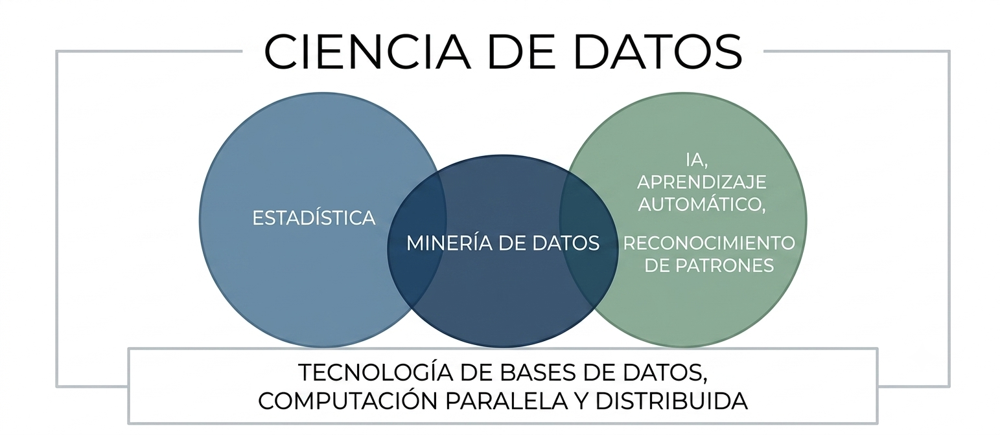
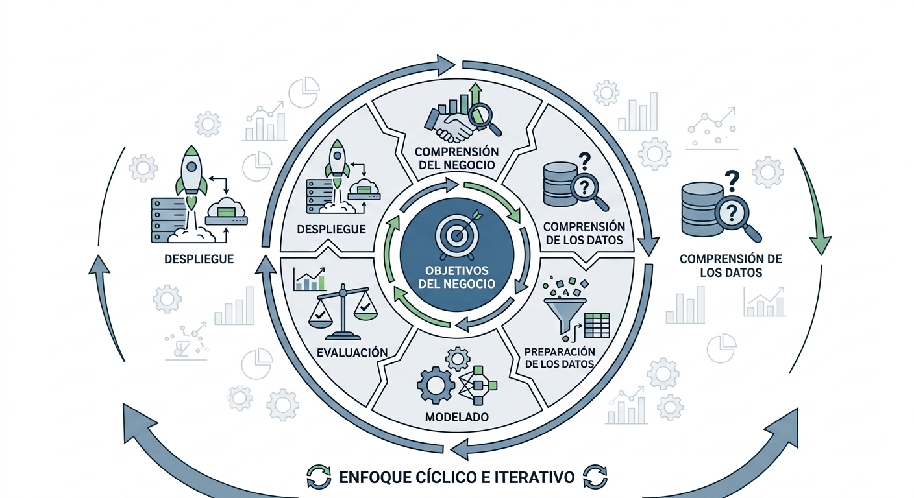
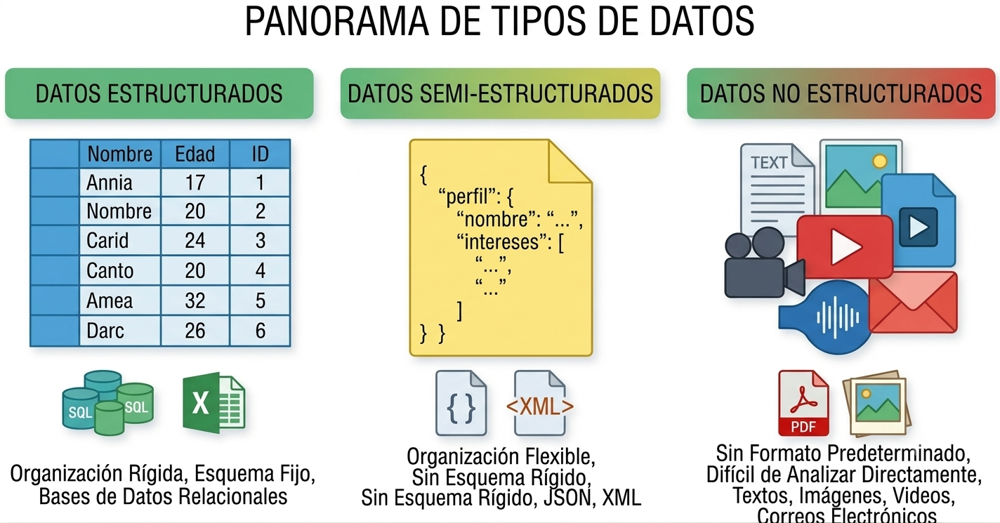

# Fundamentos de la minería de datos

## Qué es la minería de datos

> Es el análisis de **conjuntos de datos** (a menudo grandes) para encontrar **relaciones insospechadas** (conocimiento) y resumir los datos de **formas novedosas** que sean **comprensibles y útiles** para el propietario/usuario de los datos. @hand2001principles

En el ecosistema empresarial, se utiliza el aforismo de que **"los datos son el nuevo oro"**. Sin embargo, los datos en bruto son como el mineral sin procesar: carecen de valor estratégico hasta que pasan por un proceso de refinamiento analítico que los transforma en conocimiento accionable.

A diferencia de la estadística tradicional que a menudo busca confirmar hipótesis predefinidas, la minería de datos es **exploratoria** por naturaleza; busca descubrir patrones que el analista no sabía que existían. El éxito en esta disciplina no solo requiere habilidades técnicas, sino también creatividad, rigor en la experimentación y, sobre todo, mucha paciencia para interactuar con otras áreas y gestionar el pre-procesamiento de la información.

- **Datos:**
  * se refieren a instancias únicas y *primitivas* (simples objetos, personas, eventos, puntos en el tiempo, etc.)
  * describen propiedades individuales
  * a menudo son fáciles de recolectar u obtener (por ejemplo, cajeros de escáner, internet, etc.)
  * no nos permiten hacer predicciones o pronósticos
- **Conocimiento:**
  * *(Características)*: Define clases de instancias; es decir, agrupa conjuntos de observaciones o entidades que comparten propiedades comunes.
  * *(Forma)*: Se manifiesta revelando patrones generales, estructuras ocultas o reglas de comportamiento subyacentes en los datos.
  * *(Declaración)*: Busca la parsimonia; se expresa de la manera más concisa posible, utilizando la menor cantidad de reglas o afirmaciones para explicar un fenómeno.
  * *(Proceso)*: Su descubrimiento es una tarea analítica compleja, que habitualmente demanda un esfuerzo computacional y de tiempo considerable.
  * *(Acciones)*: Es accionable y útil; nos otorga la capacidad de fundamentar decisiones, realizar predicciones confiables y proyectar escenarios futuros.

::: {.callout-note}
### Actividad (10 minutos)

Elija un sector o área, describa los potenciales datos disponibles y plantee una pregunta de investigación.
:::

## Discusión Epistemológica: El Nuevo Inductivismo

La ciencia de datos representa un cambio de paradigma hacia lo que se denomina el **nuevo inductivismo** [@pietsch2022].

*   **Ciencia Fenomenológica:** A diferencia de las ciencias teóricas que buscan leyes universales e inmutables, la CD se clasifica como una **ciencia fenomenológica**. Su prioridad es la **predicción y la manipulación** de fenómenos complejos; es decir, un modelo es válido si funciona para predecir un resultado de negocio, aunque no siempre podamos explicar la teoría física subyacente [@pietsch2022].
*   **Inducción Variacional y "Difference-making":** La práctica analítica moderna busca identificar **"hacedores de diferencia"**. Una relación es relevante si, al variar una circunstancia, el fenómeno de interés cambia [@pietsch2022]. En BI, esto es vital: no basta saber que dos variables se correlacionan, necesitamos saber qué variable (ej. una oferta de descuento) causa un cambio en el comportamiento del cliente (ej. la compra) [@pietsch2022].

::: {.callout-note}
### Actividad (10 minutos)

**Contexto:** Un banco quiere mejorar su rentabilidad.

1.  Proponga una pregunta de consulta tradicional.
2.  Proponga un objetivo de minería de datos.
3.  ¿Cómo ayuda el concepto de *difference-making* a decidir qué clientes deberían recibir una llamada de cobranza preventiva? 
:::

## Flujos de trabajo

Para garantizar la replicabilidad y evitar que el análisis sea un proceso de "suerte", se utilizan marcos metodológicos estandarizados.

### KDD (Knowledge Discovery in Databases)

* **Origen**: Propuesto por @fayyad1996 en el ámbito académico para distinguir el proceso global de descubrimiento de la etapa específica de aplicación de algoritmos.
* **Fases**: 
  1. Selección, 
  2. Preprocesamiento, 
  3. Transformación, 
  4. Minería de datos, 
  5. Interpretación/Evaluación.
* **Enfoque**: Científico y centrado en la purificación técnica de los datos.

### CRISP-DM (Cross-Industry Standard Process for Data Mining)

* **Origen**: Surgió de un consorcio europeo a finales de los 90 (NCR, SPSS, Daimler-Benz) para crear un estándar no propietario adaptado a la industria [@chapman2000].
* **Fases**: 
  1. Comprensión del Negocio, 
  2. Comprensión de los Datos, 
  3. Preparación de los Datos, 
  4. Modelado, 
  5. Evaluación, 
  6. Despliegue.
* **Enfoque**: Cíclico e iterativo, priorizando los objetivos del negocio.

### SEMMA

* **Origen**: Desarrollado por el SAS Institute como metodología operativa para su software Enterprise Miner [@matignon2007].
* **Fases**: 
  1. Sample (Muestreo), 
  2. Explore (Exploración), 
  3. Modify (Modificación), 
  4. Model (Modelado), 
  5. Assess (Evaluación).
* **Enfoque**: Técnico-estadístico, orientado a la experimentación en laboratorio.

### OSEMN

* **Origen**: Acuñado por @mason2010 para simplificar el flujo de trabajo en la ciencia de datos moderna basada en scripts (R/Python).
* **Fases**: 
  1. Obtain (Obtener), 
  2. Scrub (Limpiar), 
  3. Explore (Explorar), 
  4. Model (Modelar), 
  5. iNterpret (Interpretar).
* **Enfoque**: Pragmático y ágil, ideal para entornos de desarrollo rápido y programación fluida.

### Comparación de flujos de trabajo

| Característica | KDD | CRISP-DM | SEMMA | OSEMN |
| :--- | :--- | :--- | :--- | :--- |
| **Autor / Referencia** | @fayyad1996 | @chapman2000 | @matignon2007 | @mason2010 |
| **Origen** | Academia (Ciencias de la Computación) | Consorcio Industrial (NCR, SPSS, Daimler) | Sector Software (SAS Institute) | Ciencia de Datos Moderna (Agile) |
| **Enfoque Principal** | Proceso científico de extracción de conocimiento. | Integración de los objetivos de negocio. | Experimentación técnica y estadística. | Programación ágil y flujo de código. |
| **Fases Clave** | Selección, Preprocesamiento, Transformación, Minería, Interpretación. | Negocio, Datos, Preparación, Modelado, Evaluación, Despliegue. | Sample, Explore, Modify, Model, Assess. | Obtain, Scrub, Explore, Model, iNterpret. |
| **Uso Ideal** | Investigación y desarrollo (I+D). | Gestión de proyectos corporativos. | Análisis en laboratorios estadísticos. | Prototipado rápido en R o Python. |

::: {.callout-note}
### Actividad al paso

**Instrucción:** Analice los siguientes dos escenarios y asigne la metodología que considere más adecuada. Posteriormente, identifique una "falla o limitación" de esa metodología para ese caso específico.

1. **Escenario A:** Una institución bancaria requiere un modelo de riesgo crediticio altamente auditable por entes reguladores, donde cada paso de la transformación de datos debe estar documentado estadísticamente.
2. **Escenario B:** Un equipo de marketing digital necesita probar rápidamente si un nuevo algoritmo de recomendación mejora los clics en una campaña que dura solo 48 horas.
:::

::: {.callout-note}
### Actividad (5 minutos)

Se presenta una lista de 4 acciones clave realizadas en un proyecto de análisis de sentimientos. Clasifique cada acción según el flujo de trabajo indicado.

| Acción Realizada | Fase en CRISP-DM | Fase en OSEMN |
| :--- | :--- | :--- |
| Definir que el éxito es reducir las quejas en un 20%. | | |
| Eliminar emojis y stop-words de los tweets. | | |
| Ejecutar un análisis exploratorio para ver palabras frecuentes. | | |
| Presentar una gráfica de barras con los resultados al directorio. | | |

**Pregunta de reflexión:** ¿Por qué el flujo de @mason2010 es más natural para un analista que trabaja solo, mientras que el de @chapman2000 es indispensable para un equipo que trabaja para un cliente externo?
:::

::: {.callout-tip}
### Lectura sugerida

https://ijisr.issr-journals.org/abstract.php?article=IJISR-14-281-04
::: 

::: {.callout-note}
### Actividad para su casa
Una empresa de retail quiere implementar un sistema de recomendación en su web para una campaña que inicia en 48 horas.

1.  **Debate:** ¿Usaría **CRISP-DM** u **OSEMN**?.
2.  **Riesgo:** ¿Qué peligro corre la **veracidad** de sus resultados si acelera la fase de limpieza?.
:::

## Analítica de datos

La analítica de datos es un marco amplio que gestiona el ciclo de vida completo de los datos. En la disciplina de la Minería de Datos (MD), estos niveles se distinguen por la complejidad de la tarea analítica y la naturaleza del conocimiento que se busca extraer.

A medida que se escala en la taxonomía, el analista transita de un rol observacional a uno de **descubrimiento y modelado**, aumentando proporcionalmente el valor estratégico para la toma de decisiones.

### Analítica Descriptiva: ¿Qué pasó?

Representa la base del proceso analítico y busca **contextualizar eventos que ya ocurrieron**. En minería de datos, esta etapa se asocia con las fases iniciales de **Comprensión de Datos** y **Estadística Descriptiva**, donde el objetivo es resumir las propiedades del dataset de forma comprensible.

*   **En MD:** Se centra en la inferencia descriptiva y la identificación de frecuencias o distribuciones de los atributos (EDA).
*   **Valor:** Proporciona una "comprensión en retrospectiva" (*hindsight*).

### Analítica Diagnóstica: ¿Por qué pasó?

Su objetivo es determinar la **causa raíz** de un fenómeno pasado. A diferencia de la simple visualización, en minería de datos el enfoque es la **exploración de dependencias**. Se busca identificar qué variables específicas actúan como "hacedores de diferencia" (*difference-making*), influyendo directamente en el fenómeno estudiado.

*   **En MD:** Implica el descubrimiento de relaciones insospechadas y asociaciones entre variables que expliquen las variaciones en los datos.
*   **Valor:** Aporta conocimiento y percepción profunda (*insight*).

### Analítica Predictiva: ¿Qué pasará?

Es el núcleo del **Aprendizaje Supervisado**. Se lleva a cabo en un intento de determinar el resultado de un evento futuro basándose en la fuerza y magnitud de las asociaciones encontradas en el pasado. Busca aproximar una función desconocida $f$ que mapee las variables predictoras ($X$) hacia una variable objetivo ($Y$).

*   **En MD:** Incluye tareas de **Clasificación** (metas categóricas) y **Regresión** (metas numéricas).
*   **Valor:** Genera previsión (*foresight*) y permite la identificación proactiva de riesgos y oportunidades.

### Analítica Prescriptiva: ¿Qué debemos hacer?

Es el nivel más avanzado y se construye sobre los resultados de la analítica predictiva. El enfoque no es solo predecir, sino **prescribir acciones** basadas en una comprensión situacional profunda de los modelos generados.

*   **En MD:** Se vincula con la fase de **Despliegue** (*Deployment*) y la utilización de los resultados de la minería para optimizar procesos o mitigar riesgos operativos.
*   **Valor:** Transforma el conocimiento en **sabiduría estratégica**, permitiendo razonar sobre cuál es la mejor opción a seguir.

::: {.callout-note}
### Actividad de paso
Clasifique las siguientes solicitudes de una aerolínea:

1.  "Queremos saber cuántos asientos se quedaron vacíos el año pasado". 
2.  "¿Cuál es la probabilidad de que un vuelo a La Paz se cancele por clima mañana?". 
3.  "¿Por qué perdimos el 10% de clientes frecuentes en el último semestre?". 
4.  "¿Qué precio debemos fijar hoy para llenar el avión y maximizar la ganancia?". 
:::

## Conceptos clave y estructura de datos

El objeto central de nuestro estudio es el **dataset**, una colección de datos que comparten atributos comunes.

*   **Instancia (Registro):** Una unidad única (un cliente, una transacción).
*   **Atributo (Variable):** Una propiedad individual (edad, monto de compra).
*   **Metadata:** Información sobre el origen, precisión y puntualidad de los datos.

### Estructura de la Información

1.  **Estructurados:** Formatos rígidos (tablas SQL).
2.  **No Estructurados:** Texto libre (redes sociales), audios, imágenes. Representan la mayor parte de la data actual.
3.  **Semi-estructurados:** Poseen etiquetas jerárquicas pero no son tabulares (ej. JSON de una API, XML).

## Modelos en minería de datos

Para aplicar la técnica correcta, debemos entender la intuición detrás de los modelos:

### Aprendizaje No Supervisado (Modelos Descriptivos)

La intuición es: **"Busco estructuras naturales"**. No hay una respuesta previa; queremos entender asociaciones y patrones ocultos.

*   **Clustering (Agrupamiento):** Crear grupos de clientes similares basados en su comportamiento multivariante.
*   **Asociación:** Identificar qué productos suelen "viajar juntos" en un carrito de compras.
*   **Reducción de Dimensionalidad (PCA):** Simplificar un problema de 100 variables a las 3 más importantes sin perder información esencial.

### Aprendizaje Supervisado (Modelos Predictivos)

La intuición es: **"Tengo un maestro"** (datos históricos con la respuesta conocida). El objetivo es mapear variables predictoras ($X$) a una variable objetivo ($Y$).

*   **Clasificación:** $Y$ es una clase o etiqueta (ej. "Fraude" o "No Fraude").
*   **Regresión:** $Y$ es un valor numérico (ej. la proyección de ventas).

::: {.callout-note}

### Actividad (10 minutos)
Identifique la intuición (Supervisado o No Supervisado) para:

1.  Un sistema de Netflix que sugiere películas similares a las que ya viste. 
2.  Un sistema de correos que identifica si un mensaje es SPAM. 
3.  Un análisis para identificar 3 perfiles de votantes en una base de datos de ciudadanos.
:::
