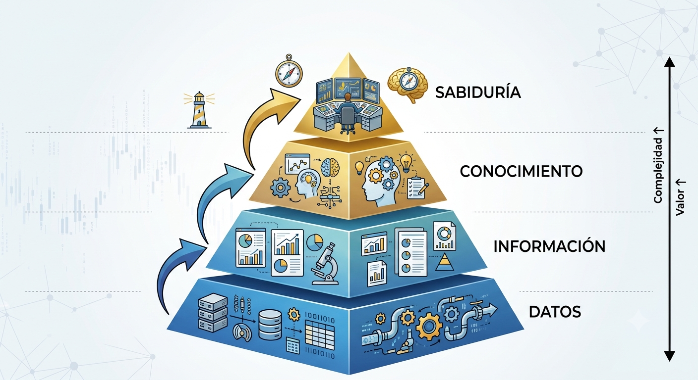
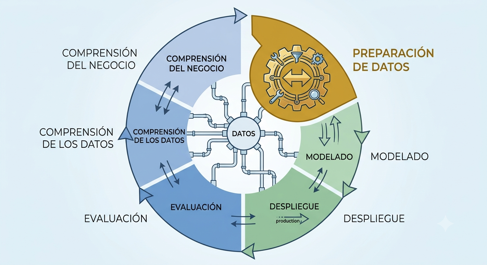
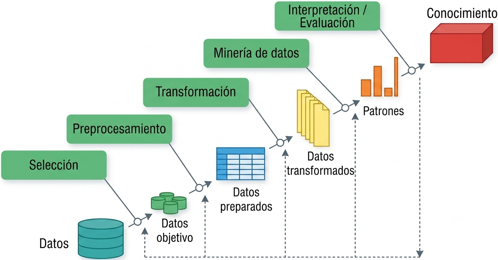
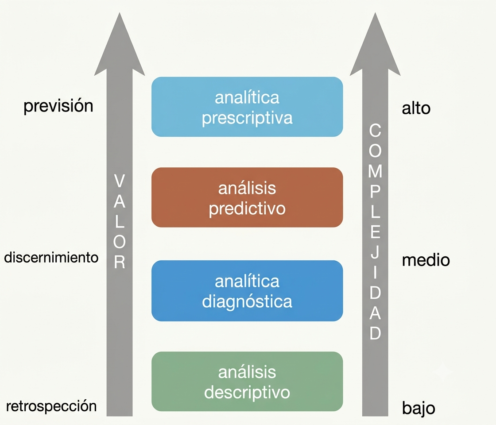

# Fundamentos de la minería de datos

## Qué es la minería de datos

La minería de datos (MD) es el proceso de analizar conjuntos de datos, a menudo de gran volumen, para encontrar **relaciones insospechadas** y resumir la información de formas novedosas, comprensibles y útiles para el propietario de los datos. En el ecosistema empresarial, se utiliza el aforismo de que **"los datos son el nuevo oro"**. Sin embargo, los datos en bruto son como el mineral sin procesar: carecen de valor estratégico hasta que pasan por un proceso de refinamiento analítico que los transforma en conocimiento accionable.

A diferencia de la estadística tradicional que a menudo busca confirmar hipótesis predefinidas, la minería de datos es **exploratoria** por naturaleza; busca descubrir patrones que el analista no sabía que existían. El éxito en esta disciplina no solo requiere habilidades técnicas, sino también creatividad, rigor en la experimentación y, sobre todo, mucha paciencia para interactuar con otras áreas y gestionar el pre-procesamiento de la información.

### Discusión Epistemológica: El Nuevo Inductivismo

La minería de datos representa un cambio de paradigma hacia lo que se denomina el **nuevo inductivismo** [@pietsch2022].

*   **Ciencia Fenomenológica:** A diferencia de las ciencias teóricas que buscan leyes universales e inmutables, la MD se clasifica como una **ciencia fenomenológica**. Su prioridad es la **predicción y la manipulación** de fenómenos complejos; es decir, un modelo es válido si funciona para predecir un resultado de negocio, aunque no siempre podamos explicar la teoría física subyacente [@pietsch2022].
*   **Inducción Variacional y "Difference-making":** La práctica analítica moderna busca identificar **"hacedores de diferencia"**. Una relación es relevante si, al variar una circunstancia, el fenómeno de interés cambia [@pietsch2022]. En BI, esto es vital: no basta saber que dos variables se correlacionan, necesitamos saber qué variable (ej. una oferta de descuento) causa un cambio en el comportamiento del cliente (ej. la compra) [@pietsch2022].

::: {.callout-note}
### Actividad de Clase (10 min)

**Contexto:** Un banco quiere mejorar su rentabilidad.

1.  **Tarea:** Proponga una pregunta de consulta tradicional (ej. "¿Cuántos clientes tienen mora mayor a 30 días?").
2.  **Tarea:** Proponga un objetivo de minería de datos (ej. "Descubrir patrones de comportamiento que diferencien a un cliente que pagará de uno que entrará en mora").
3.  **Reflexión:** ¿Cómo ayuda el concepto de *difference-making* a decidir qué clientes deberían recibir una llamada de cobranza preventiva? 
:::

## Flujos de trabajo

Para garantizar la replicabilidad y evitar que el análisis sea un proceso de "suerte", se utilizan marcos metodológicos estandarizados.

### KDD (Knowledge Discovery in Databases)

* **Origen**: Propuesto por @fayyad1996 en el ámbito académico para distinguir el proceso global de descubrimiento de la etapa específica de aplicación de algoritmos.
* **Fases**: 1. Selección, 2. Preprocesamiento, 3. Transformación, 4. Minería de datos, 5. Interpretación/Evaluación.
* **Enfoque**: Científico y centrado en la purificación técnica de los datos.

### CRISP-DM (Cross-Industry Standard Process for Data Mining)

* **Origen**: Surgió de un consorcio europeo a finales de los 90 (NCR, SPSS, Daimler-Benz) para crear un estándar no propietario adaptado a la industria [@chapman2000].
* **Fases**: 1. Comprensión del Negocio, 2. Comprensión de los Datos, 3. Preparación de los Datos, 4. Modelado, 5. Evaluación, 6. Despliegue.
* **Enfoque**: Cíclico e iterativo, priorizando los objetivos del negocio.

### SEMMA

* **Origen**: Desarrollado por el SAS Institute como metodología operativa para su software Enterprise Miner [@matignon2007].
* **Fases**: 1. Sample (Muestreo), 2. Explore (Exploración), 3. Modify (Modificación), 4. Model (Modelado), 5. Assess (Evaluación).
* **Enfoque**: Técnico-estadístico, orientado a la experimentación en laboratorio.

### OSEMN

* **Origen**: Acuñado por @mason2010 para simplificar el flujo de trabajo en la ciencia de datos moderna basada en scripts (R/Python).
* **Fases**: 1. Obtain (Obtener), 2. Scrub (Limpiar), 3. Explore (Explorar), 4. Model (Modelar), 5. iNterpret (Interpretar).
* **Enfoque**: Pragmático y ágil, ideal para entornos de desarrollo rápido y programación fluida.

| Característica | KDD | CRISP-DM | SEMMA | OSEMN |
| :--- | :--- | :--- | :--- | :--- |
| **Autor / Referencia** | @fayyad1996 | @chapman2000 | @matignon2007 | @mason2010 |
| **Origen** | Academia (Ciencias de la Computación) | Consorcio Industrial (NCR, SPSS, Daimler) | Sector Software (SAS Institute) | Ciencia de Datos Moderna (Agile) |
| **Enfoque Principal** | Proceso científico de extracción de conocimiento. | Integración de los objetivos de negocio. | Experimentación técnica y estadística. | Programación ágil y flujo de código. |
| **Fases Clave** | Selección, Preprocesamiento, Transformación, Minería, Interpretación. | Negocio, Datos, Preparación, Modelado, Evaluación, Despliegue. | Sample, Explore, Modify, Model, Assess. | Obtain, Scrub, Explore, Model, iNterpret. |
| **Uso Ideal** | Investigación y desarrollo (I+D). | Gestión de proyectos corporativos. | Análisis en laboratorios estadísticos. | Prototipado rápido en R o Python. |

El Dilema de la Metodología (Análisis Crítico)

**Instrucción:** Analice los siguientes dos escenarios y asigne la metodología que considere más adecuada. Posteriormente, identifique una "falla o limitación" de esa metodología para ese caso específico.

1. **Escenario A:** Una institución bancaria requiere un modelo de riesgo crediticio altamente auditable por entes reguladores, donde cada paso de la transformación de datos debe estar documentado estadísticamente.
2. **Escenario B:** Un equipo de marketing digital necesita probar rápidamente si un nuevo algoritmo de recomendación mejora los clics en una campaña que dura solo 48 horas.

> Actividad 2: Ingeniería Inversa de Procesos (Diferenciación)

**Instrucción:** Se presenta una lista de 4 acciones clave realizadas en un proyecto de análisis de sentimientos. Clasifique cada acción según el flujo de trabajo indicado.

| Acción Realizada | Fase en CRISP-DM | Fase en OSEMN |
| :--- | :--- | :--- |
| Definir que el éxito es reducir las quejas en un 20%. | | |
| Eliminar emojis y stop-words de los tweets. | | |
| Ejecutar un análisis exploratorio para ver palabras frecuentes. | | |
| Presentar una gráfica de barras con los resultados al director. | | |

**Pregunta de reflexión:** ¿Por qué el flujo de @mason2010 es más natural para un analista que trabaja solo, mientras que el de @chapman2000 es indispensable para un equipo que trabaja para un cliente externo?

> Lectura sugerida: https://ijisr.issr-journals.org/abstract.php?article=IJISR-14-281-04

::: {.callout-important}
### Actividad de Clase: El Dilema de la Metodología (10 min)
**Escenario:** Una empresa de retail quiere implementar un sistema de recomendación en su web para una campaña que inicia en 48 horas.
1.  **Debate:** ¿Usaría **CRISP-DM** u **OSEMN**?.
2.  **Riesgo:** ¿Qué peligro corre la **veracidad** de sus resultados si acelera la fase de limpieza?.
:::

## Analítica de datos

La analítica de datos se divide según su complejidad y el tipo de pregunta que busca responder:

*   **Analítica Descriptiva:** Responde a **"¿Qué pasó?"**. Usa estadística e inferencia descriptiva para contextualizar eventos pasados.
*   **Analítica Diagnóstica:** Responde a **"¿Por qué pasó?"**. Se enfoca en determinar la causa raíz de un fenómeno mediante el análisis de relaciones.
*   **Analítica Predictiva:** Responde a **"¿Qué pasará?"**. Construye modelos que, basados en el pasado, estiman resultados futuros.
*   **Analítica Prescriptiva:** Responde a **"¿Qué debemos hacer?"**. Basada en las predicciones, sugiere acciones para mitigar riesgos u obtener ventajas competitivas.

::: {.callout-note}
> Actividad de Clase: Clasificando la Demanda (10 min)
Clasifique las siguientes solicitudes de una aerolínea:
1.  "Queremos saber cuántos asientos se quedaron vacíos el año pasado". (Descriptiva)
2.  "¿Cuál es la probabilidad de que un vuelo a La Paz se cancele por clima mañana?". (Predictiva)
3.  "¿Por qué perdimos el 10% de clientes frecuentes en el último semestre?". (Diagnóstica)
4.  "¿Qué precio debemos fijar hoy para llenar el avión y maximizar la ganancia?". (Prescriptiva)
:::

## Conceptos clave y estructura de datos

El objeto central de nuestro estudio es el **dataset**, una colección de datos que comparten atributos comunes.

*   **Instancia (Registro):** Una unidad única (un cliente, una transacción).
*   **Atributo (Variable):** Una propiedad individual (edad, monto de compra).
*   **Metadata:** Información sobre el origen, precisión y puntualidad de los datos.

### Estructura de la Información

1.  **Estructurados:** Formatos rígidos (tablas SQL).
2.  **No Estructurados:** Texto libre (redes sociales), audios, imágenes. Representan la mayor parte de la data actual.
3.  **Semi-estructurados:** Poseen etiquetas jerárquicas pero no son tabulares (ej. JSON de una API, XML).

## El "Bosque Analítico": Visión Holística de los Modelos

Para aplicar la técnica correcta, debemos entender la intuición detrás de los modelos:

### 1. Aprendizaje Supervisado (Modelos Predictivos)
La intuición es: **"Tengo un maestro"** (datos históricos con la respuesta conocida). El objetivo es mapear variables predictoras (\\(X\\)) a una variable objetivo (\\(Y\\)).
*   **Clasificación:** \\(Y\\) es una clase o etiqueta (ej. "Fraude" o "No Fraude").
*   **Regresión:** \\(Y\\) es un valor numérico (ej. la proyección de ventas).

### 2. Aprendizaje No Supervisado (Modelos Descriptivos)
La intuición es: **"Busco estructuras naturales"**. No hay una respuesta previa; queremos entender asociaciones y patrones ocultos.
*   **Clustering (Agrupamiento):** Crear grupos de clientes similares basados en su comportamiento multivariante.
*   **Asociación:** Identificar qué productos suelen "viajar juntos" en un carrito de compras.
*   **Reducción de Dimensionalidad (PCA):** Simplificar un problema de 100 variables a las 3 más importantes sin perder información esencial.

::: {.callout-important}

### Actividad de Clase: ¿Qué modelo necesito? (10 min)
Identifique la intuición (Supervisado o No Supervisado) para:
1.  Un sistema de Netflix que sugiere películas similares a las que ya viste. (No supervisado - Asociación/Clustering)
2.  Un sistema de correos que identifica si un mensaje es SPAM. (Supervisado - Clasificación)
3.  Un análisis para identificar 3 perfiles de votantes en una base de datos de ciudadanos. (No supervisado - Clustering)
:::
