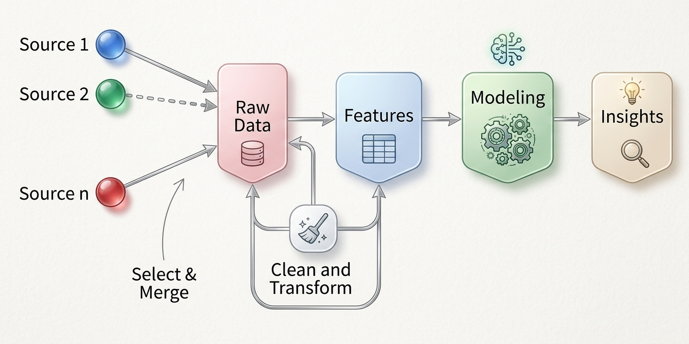

# Ingeniería de Características: Creación, Transformación y Codificación de Atributos

## Fundamentos y Propósito de la Ingeniería de Características

En el flujo de minería de datos y la Inteligencia de Negocios, los algoritmos de aprendizaje automático no operan directamente sobre conceptos abstractos de negocio, sino sobre representaciones numéricas y categóricas organizadas en tablas de datos [@shmueli2018]. La **Ingeniería de Características** (*Feature Engineering*) es el proceso metodológico de transformar datos crudos en atributos estructurados que sinteticen mejor la realidad del fenómeno estudiado, aumentando la capacidad discriminativa y predictiva de los modelos [@provost2013; @tan2019].

A menudo se asume erróneamente que el rendimiento de un sistema analítico depende primordialmente de la sofisticación del algoritmo seleccionado (ej. redes neuronales profundas o modelos de ensamble). Sin embargo, la práctica profesional demuestra que **una representación rica y bien diseñada del dominio del negocio supera de forma consistente a la complejidad algorítmica** [@provost2013]. Crear variables expresivas permite simplificar el espacio de búsqueda de los patrones, facilita la interpretabilidad de los resultados para la toma de decisiones y mitiga el problema de la alta dimensionalidad [@tan2019].

De este modo, la ingeniería de características actúa como el puente entre el conocimiento intuitivo del experto de dominio y el rigor matemático de la minería de datos. Al transformar variables simples en indicadores compuestos, binarizar categorías o discretizar rangos numéricos, el analista inyecta hipótesis de negocio directamente en la matriz de datos de entrada [@provost2013; @shmueli2018].



## Creación de Variables

La creación de atributos consiste en combinar o transformar variables existentes para construir nuevos indicadores que midan directamente la intensidad, proporción o tendencia de un fenómeno [@provost2013; @shmueli2018].

### 1. Ratios y Tasas Financieras o Comerciales

Las variables absolutas (como el ingreso bruto o la deuda total de un cliente) suelen estar condicionadas por la escala del sujeto de estudio [@shmueli2018]. Construir **ratios y proporciones** permite estandarizar las mediciones y capturar el nivel de riesgo o eficiencia de manera comparable entre distintas observaciones [@provost2013]:

Proporción: 

$$P_A=\frac{\#A}{N}$$

$$R_{a/b}=\frac{\#A}{\#B}=\frac{t_a}{t_b}$$

### 2. Transformaciones No Lineales y Escalamiento
Cuando las variables cuantitativas presentan distribuciones fuertemente asimétricas hacia la derecha (*right-skewed*) o diferencias extremas de escala, se deben aplicar transformaciones matemáticas para estabilizar su varianza y ajustar su comportamiento [@torgo2017; @tan2019].

* **Transformación Logarítmica:** Aplica la función $y = \log(x)$ (o $y = \log(x + 1)$ si existen valores nulos) para comprimir escalas numéricas de alta dispersión (como ingresos, precios de inmuebles o poblaciones) y reducir la influencia desproporcionada de valores extremos [@torgo2017; @tan2019].
* **Transformación Box-Cox:** Una familia de transformaciones de potencia parametrizada por $\lambda$ utilizada para aproximar variables continuas hacia una distribución normal multivariante [@johnson2014]:
  $$y^{(\lambda)} = \begin{cases} \frac{x^\lambda - 1}{\lambda} & 	ext{si } \lambda 
eq 0 \ \log(x) & 	ext{si } \lambda = 0 \end{cases}$$
* **Estandarización Z-score vs Normalización Max-Min:** 
  * La **Estandarización Z-score** ($z = \frac{x - \bar{x}}{\sigma}$) transforma la variable para que tenga media 0 y desviación estándar 1, conservando la detección de outliers univariantes [@shmueli2018].
  * La **Normalización Max-Min** ($y = \frac{x - \min(x)}{\max(x) - \min(x)}$) acota estrictamente los valores en el rango $[0, 1]$, siendo indispensable para algoritmos basados en distancias geométricas como k-NN, K-Means y Redes Neuronales [@tan2019; @shmueli2018].

::: {.callout-note}
### Actividad de Clase

**Escenario:** Una entidad financiera en Bolivia desea predecir la probabilidad de mora en créditos de consumo. El dataset original contiene únicamente cuatro columnas: `ingreso_mensual`, `monto_credito_solicitado`, `plazo_meses` y `cantidad_dependientes_familias`.

1. Propongan dos nuevos indicadores (ratios o combinaciones) creados a partir de las cuatro variables originales que capturen mejor la capacidad real de pago del cliente.
2. Justifiquen si aplicarían una transformación logarítmica sobre la variable `ingreso_mensual` antes de entrenar un modelo predictivo lineal y comente el impacto en la distribución.
:::

## Codificación y Tratamiento de Variables Categóricas

Las variables cualitativas o categóricas (como el estado civil, la sucursal o el tipo de contrato) requieren ser representadas en un formato numérico adecuado para que la mayoría de los algoritmos de minería de datos puedan procesarlas [@shmueli2018; @tan2019].

### Binarización y Variables Indicadoras (Dummy / One-Hot Encoding)
Consiste en descomponer una variable categórica nominal que posee $m$ niveles disjuntos en un conjunto de variables binarias $\{0, 1\}$ [@shmueli2018; @tan2019].

| Categoría Original (`Sucursal`) | Dummy 1 (`sucursal_LaPaz`) | Dummy 2 (`sucursal_Cochabamba`) | Dummy 3 (`sucursal_SantaCruz`) |
| :--- | :---: | :---: | :---: |
| La Paz | 1 | 0 | 0 |
| Cochabamba | 0 | 1 | 0 |
| Santa Cruz | 0 | 0 | 1 |

#### La Trampa de la Variable Dummy (*Dummy Variable Trap*)
Para evitar la multicolinealidad perfecta en modelos de regresión lineal o logística (donde la suma de las columnas binarias es igual a un vector constante de 1s), se debe omitir una de las categorías para que actúe como **nivel de referencia** [@shmueli2018; @johnson2014]. De este modo, un factor con $m$ categorías genera exactamente $m - 1$ variables dummy auxiliares.

### Condensación y Agrupamiento de Alta Cardinalidad
Cuando una variable categórica posee docenas o cientos de niveles (ej. 500 códigos postales o 100 profesiones), la binarización directa expande desproporcionadamente el número de columnas del dataset, provocando el fenómeno del **aumento excesivo de dimensionalidad**.

Para solucionar la alta cardinalidad, se emplean dos estrategias principales:

1. **Agrupamiento por Frecuencia:** Fusionar categorías raras o poco frecuentes (ej. con frecuencia menor al 2% o 5% del dataset) bajo una etiqueta común denominada "Otros".
2. **Agrupamiento Experto o por Perfil:** Unir categorías que compartan un comportamiento o nivel de riesgo similar respecto a la variable objetivo (por ejemplo, agrupar profesiones según su nivel salarial promedio).


## Discretización y Binning de Variables Continuas

La **discretización** (o *binning*) es el proceso de transformar una variable cuantitativa continua en un número finito de intervalos o categorías ordenadas. Esta técnica es fundamental cuando se utilizan modelos que requieren entradas categóricas (como reglas de asociación) o para capturar relaciones no lineales complejas de forma lineal [@tan2019; @shmueli2018].

```
Variable Continua (Edad) ──> [Intervalos / Bins] ──> Categoría Ordinal (Joven, Adulto, Senior)
```

Estructuramos la discretización bajo dos enfoques metodológicos:

### 1. Enfoque No Supervisado (Sin considerar la variable objetivo)

* **Ancho Constante (*Equal Width / Equal Interval*):** Divide el rango numérico $[\min(x), \max(x)]$ en $k$ intervalos de amplitud idéntica $w = \frac{\max(x) - \min(x)}{k}$. Es muy sensible a la presencia de outliers, ya que los valores extremos pueden dejar la mayoría de los contenedores vacíos.
* **Frecuencia Constante / Cuantiles (*Equal Frequency / Quantiles*):** Ajusta los puntos de corte (*split points*) de modo que cada uno de los $k$ intervalos contenga aproximadamente el mismo número de observaciones ($N/k$). Es una técnica robusta que preserva la densidad local de los datos.

### 2. Enfoque Supervisado (Guiado por la variable objetivo $Y$)

* **Discretización Basada en Entropía / Ganancia de Información:** Evalúa de forma iterativa los puntos de corte candidatos que maximizan la pureza o la ganancia de información respecto a las clases de la variable objetivo ($Y$), minimizando la entropía condicional $H(Y \mid X)$.

En R base, la discretización se ejecuta con la función `cut()`, mientras que la librería `Hmisc` provee `cut2()` para manejar cuantiles e intervalos automáticamente.

::: {.callout-important}
### Actividad de Clase: Selección del Método de Discretización

**Escenario:** Se analiza la distribución de la variable `valor` del dataset de exportación. La variable presenta una concentración masiva valores bajos y unos pocos con valores gigantescos.

**Instrucción:** 

1. Explique qué problema ocurriría si aplica una discretización de **Ancho Constante** con 5 intervalos sobre este atributo.
2. Justifique por qué el método de **Frecuencia Constante (Cuantiles)** o la transformación logarítmica previa resolvería mejor la representación de esta variable para un modelo.
:::

## Variables Temporales, Secuenciales y de Contexto

Las variables asociadas a fechas y marcas temporales (*timestamps*) contienen una riqueza de información estratégica que no puede consumirse directamente como un número de serie o texto libre. La ingeniería de características para datos temporales se enfoca en tres áreas:

1. **Descomposición de Componentes de Fecha:** Extraer elementos individuales mediante: año, mes, día del mes, día de la semana, trimestre, hora del día e indicador binario de fin de semana o feriado.
2. **Variables de Rezago (*Lag Features*) y Variación:** En series temporales y registros financieros, se construyen variables que comparan el valor actual $X_t$ con períodos previos $X_{t-1}$, o que miden variaciones porcentuales relativas $\Delta \% = \frac{X_t - X_{t-1}}{X_{t-1}}$.
3. **Ventanas Móviles (*Rolling / Sliding Features*):** Calcular estadísticas agregadas (media móvil, desviación estándar móvil) sobre ventanas de tiempo recientes (ej. promedio de compras en los últimos 7, 30 o 90 días) para capturar tendencias de consumo recientes.


## Implementación Práctica en R con `dplyr`, `forcats` y `recipes`

A continuación, se presentan los flujos de código en R para ejecutar ingeniería de características de forma reproducible utilizando `tidyverse` y el paquete especializado `recipes` [@shmueli2018; @wickham2019].

::: {.panel-tabset}

### Transformaciones con `dplyr`
Uso de `mutate()`, `case_when()` y `cut()` para crear indicadores y discretizar variables:
```r
library(dplyr)
library(lubridate)

# Cargar dataset de clientes simulado
data(iris)

df_transformado <- iris %>%
  mutate(
    # 1. Transformación logarítmica y escalamiento Z-score
    log_petal_length = log(Petal.Length),
    z_sepal_width    = scale(Sepal.Width),
    
    # 2. Creación de un ratio numérico entre dimensiones de pétalo
    ratio_petalo = Petal.Length / Petal.Width,
    
    # 3. Discretización no supervisada por cuantiles (terciles)
    categoria_longitud = cut(
      Sepal.Length, 
      breaks = quantile(Sepal.Length, probs = seq(0, 1, length.out = 4)),
      labels = c("Bajo", "Medio", "Alto"),
      include.lowest = TRUE
    ),
    
    # 4. Binarización condicional lógica
    es_petalo_grande = ifelse(Petal.Length > 4.5, 1, 0)
  )
```

### Binarización y Factores con `model.matrix` y `forcats`
Creación de variables dummy y colapso de niveles raras con `forcats`:
```r
library(dplyr)
library(forcats)

# 1. Colapsar categorías raras de un factor
df_factores <- iris %>%
  mutate(
    especie_mod = fct_collapse(
      Species,
      `no_setosa` = c("versicolor", "virginica")
    )
  )

# 2. Generar matriz de variables dummy implícita (omitida la primera categoría base)
matriz_dummies <- model.matrix(~ Species, data = iris)
head(matriz_dummies)
```

### Tuberías Profesionales con `recipes`
El paquete `recipes` (parte de `tidymodels`) permite definir una receta de preprocesamiento modular que se aplica secuencialmente sobre conjuntos de entrenamiento y prueba evitando fuga de información (*data leakage*):

```r
library(recipes)

# Definir la receta de preprocesamiento e ingeniería de características
receta_preproc <- recipe(Species ~ ., data = iris) %>%
  step_log(Petal.Length) %>%                  # Transformación logarítmica
  step_normalize(all_numeric_predictors()) %>% # Estandarización Z-score
  step_dummy(all_nominal_predictors())        # Binarización One-Hot

# Preparar la receta con los datos de entrenamiento
receta_preparada <- prep(receta_preproc, training = iris)

# Aplicar las transformaciones
datos_listos <- bake(receta_preparada, new_data = iris)
head(datos_listos)
```
:::

## Cápsula de Ejercicios de Ingeniería de Características

::: {.callout-tip}
### Ejercicios de Aplicación Práctica (Para portafolio de clase)

1. **Creación de Ratios e Indicadores Comerciales:** Utilizando el dataset `Boston` de la librería `MASS`, construya un flujo con `dplyr::mutate()` para generar:
   a) Un ratio entre la tasa de criminalidad `crim` y la proporción de zonas residenciales `zn` [@shmueli2018].
   b) Una variable binarizada `es_casa_costosa` que tome el valor de $1$ si el valor mediano de la vivienda `medv` supera el percentil 75 del dataset, y $0$ en caso contrario.
2. **Discretización Comparativa:** Tome la variable `age` del dataset `Boston`:
   a) Aplique una discretización de **Ancho Constante** de 4 intervalos con la función `cut()` [@tan2019].
   b) Aplique una discretización de **Frecuencia Constante (Cuantiles)** de 4 intervalos utilizando los percentiles ($0.25, 0.50, 0.75$) [@shmueli2018].
   c) Compare mediante `table()` la cantidad de observaciones en cada intervalo para ambos métodos y discuta la distribución resultante.
3. **Flujo Integrado con `recipes`:** Diseñe un objeto `recipe` con la librería `recipes` sobre el dataset de ventas o flores que ejecute la siguiente secuencia en orden:
   a) Transformación logarítmica sobre todas las variables numéricas con sesgo positivo.
   b) Normalización Max-Min en el rango $[0, 1]$ para todas las variables numéricas.
   c) Binarización dummy para todas las variables categóricas, verificando que la matriz resultante no contenga columnas redundantes.
:::
