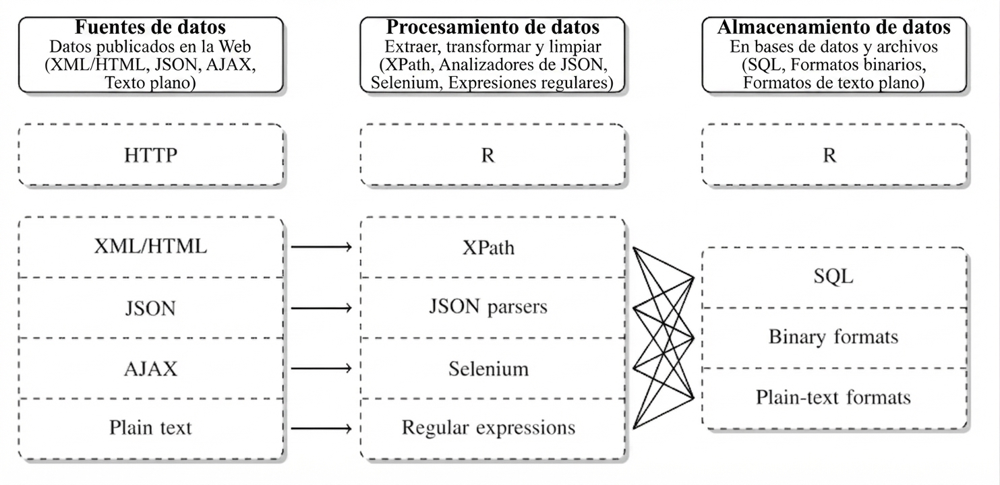

# Adquisición de Datos en la Web: Web Scraping y APIs

## Captura y Preservación de la Información

En el ámbito del análisis de datos, el primer paso crítico consiste en obtener información de calidad mediante un proceso sistemático de captura y preservación. Tradicionalmente, la estadística y la investigación social han dependido de **fuentes convencionales** como censos, encuestas por muestreo y registros administrativos. 

Sin embargo, en el ecosistema digital moderno, la Inteligencia de Negocios y la minería de datos exigen incorporar la captura de información generada en espacios digitales, redes sociales y portales web. Este cambio metodológico demanda del analista **mucha paciencia** y creatividad, ya que la interacción con áreas externas y el preprocesamiento de datos crudos consumen la mayor parte del esfuerzo técnico.

La justificación de este esfuerzo radica en la naturaleza de los datos del mundo real: independientemente de su origen, la mayoría de los datos son **ruidosos, inconsistentes y adolecen de valores perdidos**. Por ello, aunque la recopilación en la web pueda parecer de bajo costo, la creación de datos de alta calidad mediante limpieza, estandarización e integración representa una inversión considerable para cualquier organización.


| Característica | Estudio Observacional | Registro Transaccional |
| --- | --- | --- |
| **Origen** | Diseñado ex profeso (con intensión) para investigar o medir. | Generado automáticamente por una operación del día a día. |
| **Intención** | Analítica / Científica. | Operativa / Administrativa. |
| **Intervención** | El investigador diseña las preguntas o variables a medir. | El sistema registra el evento tal como sucede por necesidad operativa. |

## El Ciclo de Recopilación de Información (Los 5 Pasos de Iacus)

Para evitar sesgos y garantizar que la recolección automática de información de los sitios web sea un proceso científico [@Iacus2015], se debe seguir una secuencia metodológica estructurada:

```
[1. Definición de Necesidad] ──> [2. Identificación de Fuentes] ──> [3. Teoría de Generación]
                                                                            │
[5. Toma de Decisión y Raspado] <── [4. Balance y Aspecto Legal] <──────────┘
```

1.  **Definición de la Necesidad de Información:** Delimitar con precisión qué datos se requieren para apoyar una mejor toma de decisiones dentro del negocio.
2.  **Identificación de Fuentes en la Web:** Buscar portales digitales que contengan los atributos o propiedades requeridos para el estudio.
3.  **Teoría del Proceso de Generación de Datos:** Comprender quién genera el dato, con qué frecuencia se actualiza y qué sesgos potenciales puede contener la plataforma de origen.
4.  **Balance de Ventajas, Desventajas y Legalidad:** Evaluar la viabilidad técnica de la captura frente a las políticas de uso del portal y el archivo `robots.txt` del servidor. *https://www.ejemplo.com/robots.txt*
5.  **Toma de Decisión e Inicio de la Recopilación:** Diseñar el script de extracción automatizada resguardando la preservación y consistencia de los datos capturados.

::: {.callout-note}
### Actividad: Planificando la Captura (10 min)
**Instrucción:** En grupos de tres estudiantes, elijan un portal de comercio electrónico o de noticias de su país.

1. Definan un objetivo de negocio que requiera raspar ese sitio.
2. Identifiquen si los datos que obtendrán son el resultado de un estudio observacional o un registro transaccional.
3. Mencionen dos posibles inconsistencias o ruidos que esperan encontrar en la data cruda.
:::

## Fundamentos Tecnológicos de la Web: HTML y CSS

Para realizar la extracción automática de datos sin la intervención de un humano que navegue visualmente [@Mitchell2015], debemos entender el lenguaje con el que están construidas las páginas. El **HTML** (*HyperText Markup Language*) es un lenguaje de texto que se utiliza para estructurar y desplegar una página web.

HTML funciona bajo una **estructura jerárquica y entornos de encapsulamiento** definidos por etiquetas (tags) y atributos. Por ejemplo:

```html
<div class="oferta" id="sucursal_la_paz">
  <span class="producto">Laptop de Oficina</span>
  <span class="precio">750.00 USD</span>
</div>
```

En minería de datos, no necesitamos leer todo el código de una página. El diseño estético de la web utiliza hojas de estilo (CSS) que asignan clases (como `.producto` o `.precio`) a los elementos. Estas clases actúan como **selectores o direcciones postales** que le permiten a nuestro código en R extraer quirúrgicamente la información de interés.



## Raspado Web Práctico en R con `rvest`

En R, la librería diseñada para interactuar con páginas estáticas y realizar raspado web es **`rvest`**, la cual forma parte del universo de herramientas de **`tidyverse`**. Para facilitar la identificación del selector CSS de cualquier elemento sin inspeccionar manualmente el código, se emplea la extensión de navegador **SelectorGadget**.

::: {.panel-tabset}

### Instalación y Carga
Para comenzar a trabajar con `rvest`, instale el paquete desde el CRAN y cárguelo en su sesión de trabajo junto con el núcleo de `tidyverse`:
```r
# Instalación (se ejecuta una sola vez)
install.packages("rvest")

# Carga de librerías en la sesión actual
library(rvest)
library(dplyr)
```

### Funciones Clave
La extracción con `rvest` se basa en cuatro funciones secuenciales que procesan la información mediante la tubería o *pipe* (`%>%`):
*   `read_html()`: Carga y analiza la estructura jerárquica del documento HTML.
*   `html_nodes()`: Extrae los entornos específicos que coinciden con el selector CSS.
*   `html_text()`: Limpia el código de marcado y extrae únicamente el texto plano.
*   `html_table()`: Convierte tablas HTML (`<table>`) directamente en estructuras de datos de R (*data frames*).

### Ejemplo de Raspado
A continuación se presenta la sintaxis estándar para estructurar texto extraído de un contenedor web:
```r
library(rvest)
library(dplyr)

# 1. Leer el portal web de origen
url_portal <- "https://ejemplo-tienda-bolivia.com"
web_html   <- read_html(url_portal)

# 2. Capturar nodos y transformarlos a un vector de texto limpio
nombres_productos <- web_html %>%
  html_nodes(".producto") %>%
  html_text()
```
:::

::: {.callout-tip}
### Ejercicios

1. Obtén la tabla de esta fuente y genera un dataframe. https://www.bcb.gob.bo/tco_reporte_detalle_historico.php?fecha=2026-08-20 
2. Hacer web scraping de un portal de comercio electrónico, clasificados o supermercados locales en Bolivia.
3. Hacer un web scraping de una biblioteca universitaria digital en Bolivia y capturar una búsqueda de interés.
:::

## Interfaces de Programación de Aplicaciones (APIs)

Aunque el raspado web es una herramienta flexible, tiene una limitación: si el administrador de la página cambia el diseño o el nombre de las clases CSS, el código fallará. Como alternativa estructurada, existen las **APIs** (*Application Programming Interface*).

Las APIs son **puertas de entrada creadas por los administradores de una página web** que permiten el acceso controlado a información seleccionada en formatos amigables y altamente estructurados (como JSON o XML), aunque debido a esto no siempre contienen toda la información que el analista desea.

| Dimensión Analítica | Web Scraping Tradicional | Acceso por APIs Oficiales |
| :--- | :--- | :--- |
| **Estabilidad** | Baja (sensible a rediseños estéticos de la web)  | Alta (los esquemas de datos permanecen estables). |
| **Estructura** | No estructurada (requiere transformaciones complejas) | Altamente estructurada (JSON, XML listos para análisis). |
| **Limitaciones** | Bloqueos de IP por peticiones masivas | Regulado por cuotas de acceso y claves de autenticación. |

### Caso Práctico: Consumo de la API del Banco Mundial

La API del Banco Mundial ofrece acceso libre a más de **16,000 indicadores de series de tiempo** con una cobertura histórica superior a los 50 años para la mayoría de los países. En R, no necesitamos realizar peticiones HTTP manuales para consumir esta API, ya que existe la librería especializada **`wbstats`** que encapsula las consultas de manera directa.

```r
# Instalar y cargar la librería de acceso a la API del Banco Mundial
install.packages("wbstats")
library(wbstats)

# Buscar indicadores relacionados con el desempleo
busqueda_desempleo <- wb_search("unemployment")

# Descargar datos de desempleo para Bolivia desde el año 2000
datos_bolivia <- wb_data(
  country = "BO", 
  indicator = "SL.UEM.TOTL.ZS", 
  start_date = 2000, 
  end_date = 2025
)
```

::: {.callout-tip}
### Ejercicios de Aplicación Práctica

1.  **Raspado de Tipo de Cambio Oficial:** Diseñe un script en R utilizando `rvest` para extraer el precio de compra y venta del dólar estadounidense, así como la fecha de actualización, desde la página oficial del **Banco Central de Bolivia** (https://www.bcb.gob.bo). Asegúrese de guardar los resultados en un data frame estructurado con nombres de atributos limpios.
2.  **Estructuración de Ofertas Laborales:** Utilice la estructura de la plataforma **Trabajópolis** (https://www.trabajopolis.bo) para seleccionar un departamento de Bolivia y armar un data frame que contenga: título del empleo, empresa ofertante y salario (si está disponible). Identifique los desafíos de limpieza de texto asociados a este ejercicio.
3.  **Análisis de Tendencias con gtrendsR:** Instale la librería `gtrendsR` para consumir la API de Google Trends. Realice una consulta para evaluar en qué meses del año es más frecuente la búsqueda del término "descuentos" o "compras" en Bolivia, y comente cómo esta información apoya la analítica predictiva de una empresa de retail.
:::
