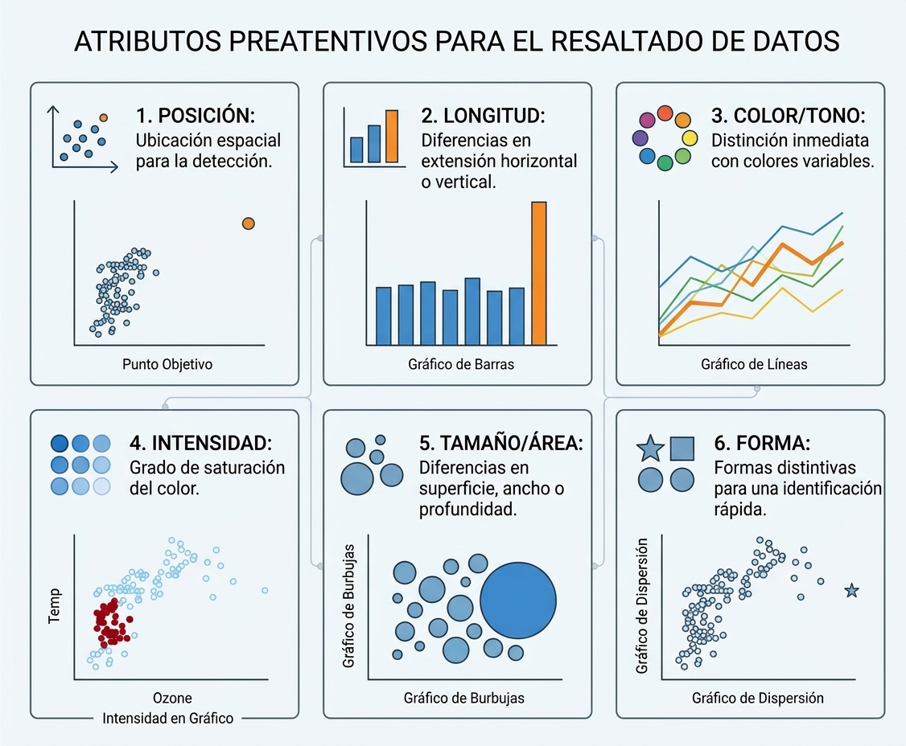

# Visualización de Datos, Dashboards y Data Storytelling

## Fundamentos y Psicología de la Visualización de Datos

La visualización de datos es el puente cognitivo entre el procesamiento analítico y la toma de decisiones estratégicas. En el marco de la Inteligencia de Negocios y la minería de datos, los usuarios procesan, comprenden y recuerdan representaciones visualmente estructuradas de manera significativamente más rápida que la información en tablas numéricas no estructuradas [@few2009]. Este fenómeno se fundamenta en la **psicología** perceptiva, la **estadística** y el **diseño** gráfico, disciplinas que convergen para reducir la carga cognitiva del observador [@tufte2001].

Al diseñar una representación gráfica, el objetivo principal es maximizar la eficiencia en la transmisión de información. Edward Tufte introdujo el concepto del **ratio dato-tinta** (*data-ink ratio*), el cual establece que la mayor parte de la tinta (o píxeles en una pantalla) debe dedicarse a mostrar datos sustanciales, eliminando elementos decorativos redundantes o distractores. Cuando se satura un gráfico con colores innecesarios, líneas de cuadrícula pesadas o efectos tridimensionales sin significado, se genera el problema conocido como "sopa de espagueti" (*rainbow spaghetti*), donde la abundancia visual sofoca la capacidad de extracción de patrones [@abbott2024].

### Atributos Preatentivos y Principios Gestalt

El sistema visual humano procesa ciertos atributos de manera inconsciente e instantánea antes de que la atención consciente intervenga. Estos **atributos preatentivos** abarcan la posición espacial, la forma, el tamaño y el color (tono e intensidad) [@knaflic2015]. Al modificar estratégicamente una de estas propiedades —por ejemplo, aplicando un color de acento único sobre una serie en tonos grises—, el analista puede guiar la mirada del espectador directamente hacia el hallazgo clave (*takeaway*).

Complementariamente, los **principios de la psicología Gestalt** explican cómo la mente humana agrupa elementos individuales en un todo organizado:

* **Proximidad:** Tendemos a percibir los objetos que están físicamente cercanos entre sí como parte de un mismo grupo.
* **Similitud:** Los elementos que comparten atributos visuales (mismo color, forma o tamaño) son asociados automáticamente como pertenecientes a la misma categoría.
* **Encierro (*Enclosure*):** Elementos delimitados por un borde o un fondo sombreado son percibidos como un bloque de información diferenciado.
* **Conexión:** Los objetos conectados por líneas continuas se perciben como vinculados jerárquicamente o temporalmente.
* **Continuidad:** La mente prefiere seguir trayectorias suaves y continuas en lugar de cambios bruscos de dirección.



## Guía Taxonómica de Tipos de Visualización

Elegir el tipo de gráfico adecuado depende del propósito analítico y de la estructura de las variables a representar. A continuación, se presenta una clasificación estandarizada de las visualizaciones más utilizadas en la minería de datos y la analítica corporativa.

### 1. Comparación y Categorías

* **Gráficos de Barras (Verticales y Horizontales):** Son el estándar de excelencia para comparar magnitudes discretas . Las barras horizontales son ideales cuando las etiquetas categóricas son largas. *Regla de oro:* Los gráficos de barras deben iniciar estrictamente en una línea base de cero para evitar distorsionar visualmente las proporciones.
* **Barras Apiladas (*Stacked Bars*) y 100% Apiladas:** Permiten evaluar la composición interna de categorías secundarias. Las barras 100% apiladas son eficientes para comparar proporciones relativas entre grupos .
* **Gráficos de Cascada (*Waterfall Charts*):** Utilizados ampliamente en finanzas y auditoría para mostrar el impacto acumulativo de adiciones y deducciones sobre una cantidad inicial.

### 2. Tendencia y Series Temporales

* **Gráficos de Líneas:** Son la opción idónea para mostrar la evolución continua de atributos cuantitativos a lo largo del tiempo.
* **Gráficos de Pendiente (*Slopegraphs*):** Variación de los gráficos de líneas restringida a dos puntos temporales o comparaciones de grupos, permitiendo visualizar de inmediato cambios relativos en la magnitud o el rango (*ranking*).

### 3. Distribución de Variables

* **Histogramas y Diagramas de Densidad:** Muestran la forma, simetría y modalidad de la distribución de una variable continua.
* **Diagramas de Caja (*Boxplots*) y Violín (*Violin Plots*):** Resumen la distribución mediante estadísticos robustos (mediana, cuartiles y atípicos). El gráfico de violín combina la caja con una estimación suavizada de la densidad.

### 4. Relación y Correlación

* **Gráficos de Dispersión (*Scatterplots*):** Muestran la relación bi-variante entre dos variables numéricas, revelando tendencias lineales, no lineales o agrupamientos.
* **Mapas de Calor (*Heatmaps*):** Utilizan la intensidad del color sobre una matriz para representar la correlación entre variables numéricas o la frecuencia entre variables categóricas.

### 5. Composición y Parte-Todo

* **Gráficos de Rosca (*Donut Charts*) y Minigráficos (*Waffle/Square Area Charts*):** Se recomiendan para transmitir porcentajes simples con no más de dos o tres segmentos. *Advertencia:* Se deben evitar los gráficos de pastel (*pie charts*) saturados de categorías y las representaciones en 3D, ya que el ojo humano es ineficiente estimando ángulos y áreas.

::: {.callout-note}
### Actividad: Selección Crítica del Gráfico (10 min)
**Escenario de Negocio:** Un equipo de marketing desea presentar los siguientes tres hallazgos a la junta directiva:

1. El rendimiento porcentual mensual de 5 campañas publicitarias durante los últimos 12 meses.
2. La relación entre la edad de los clientes y el monto total consumido en la tienda en línea.
3. La proporción de clientes satisfechos versus insatisfechos con el servicio de entrega.

**Instrucción:** En parejas, determinen qué tipo de gráfico es el más adecuado para cada uno de los tres requerimientos de información, justificando su elección.
:::

## KPIs y Diseño de Dashboards

En el entorno operativo de la Inteligencia de Negocios, la información consolidada se consume principalmente a través de **cuadros de mando o Dashboards**. Un dashboard es una interfaz gráfica de monitoreo que sintetiza múltiples fuentes de datos para evaluar el estado de una organización en tiempo real o en intervalos periódicos [@erl2016].

### Indicadores Clave de Rendimiento (KPIs)

El corazón de un dashboard reside en los **KPIs** (*Key Performance Indicators*), métricas cuantificables que miden el nivel de desempeño de un proceso crítico de negocio. Para que un KPI sea numéricamente informativo, no debe presentarse como un valor aislado; debe acompañarse de contexto comparativo:

* **Tarjetas de KPI (*KPI Cards*):** Muestran la métrica principal resaltada en tipografía de gran tamaño.
* **Contexto Comparativo:** Inclusión de metas objetivo (*targets*), variaciones porcentuales respecto al período anterior y tendencias históricas breves.

```
  ┌──────────────────────────────────────────────┐
  │  INGRESOS MENSUALES                         │
  │  $ 124,500 BOB                              │
  │  ▲ +12.5% vs. Mes Anterior | Meta: $ 115,000 │
  │  📈 ────────/\─/──                           │
  └──────────────────────────────────────────────┘
```

### Principios de Maquetación y la Regla de Shneiderman

El diseño de un dashboard debe seguir un principio de estructuración visual jerárquica. Para guiar al usuario sin abrumarlo, se aplica el paradigma de Ben Shneiderman (*Visual Information-Seeking Mantra*):

> *"Overview first, zoom and filter, then details-on-demand."* (Visión general primero, zoom y filtrado, luego detalles bajo demanda).

1. **Nivel Superior (Visión General):** Tarjetas de KPIs estratégicos situados en la parte superior del tablero.
2. **Nivel Medio (Zoom y Filtrado):** Gráficos de tendencias temporales y comparaciones regionales equipados con filtros interactivos (selectores de fecha, sucursal o categoría).
3. **Nivel Inferior (Detalles bajo Demanda):** Tablas detalladas o componentes de desglose a los que el usuario accede únicamente cuando requiere investigar una anomalía.

### Ecosistema de Herramientas de Visualización

Actualmente existe una amplia variedad de plataformas para la construcción de soluciones visuales, las cuales se clasifican según su flexibilidad y nivel de código:

* **Hojas de Cálculo (Excel, Google Sheets):** Accesibles y ubicuas, idóneas para análisis ad-hoc y gráficos simples.
* **Plataformas de Business Intelligence (Power BI, Tableau, Spotfire):** Diseñadas para la gestión empresarial masiva, modelado multidimensional y dashboards interactivos no programados.
* **Lenguajes de Programación y Código Reproducible (R, Python, D3.js):** Ofrecen máxima flexibilidad, auditabilidad completa e integración nativa con flujos de minería de datos y ciencia de datos.

## Implementación en R: De `ggplot2` a Dashboards Web

El ecosistema de R destaca por su capacidad para llevar análisis estadísticos y modelos de minería directamente a reportes y tableros interactivos.

### La Gramática de Gráficos con `ggplot2`

La librería `ggplot2` implementa la teoría de la **Gramática de Gráficos** formulada por Leland Wilkinson [@wilkinson2005; @wickham2016]. Bajo este paradigma, un gráfico no es una figura estática monolítica, sino la superposición secuencial de **capas independientes** vinculadas mediante el operador `+` [@wickham2016]:

1. **Data:** El dataset estructurado en formato data frame o tibble.
2. **Aesthetics (`aes`):** Mapeo de variables del dataset a propiedades visuales (ejes `x`, `y`, `color`, `fill`, `size`, `shape`).
3. **Geometries (`geom_*`):** La representación física de los datos (puntos, líneas, barras, cajas).
4. **Statistics (`stat_*`):** Transformaciones estadísticas integradas (conteo de frecuencias, suavizado de regresión).
5. **Scales (`scale_*`):** Control del rango y mapeo de ejes numéricos o paletas cromáticas.
6. **Facets (`facet_*`):** División del gráfico en múltiples paneles según categorías.
7. **Theme (`theme_*`):** Personalización estética no asociada a los datos (tipografía, colores de fondo, leyendas).

::: {.panel-tabset}

### Comparativa: R Base vs. ggplot2
Sintaxis para construir un gráfico de dispersión con línea de tendencia en R Base y `ggplot2`:

```r
# Cargar librerías
library(ggplot2)

# 1. R Base
plot(iris$Petal.Length, iris$Petal.Width, 
     col = iris$Species, pch = 19,
     xlab = "Longitud del Pétalo", ylab = "Ancho del Pétalo",
     main = "R Base: Relación Bi-variante")
abline(lm(Petal.Width ~ Petal.Length, data = iris), col = "black", lty = 2)

# 2. ggplot2 (Estructura por Capas)
ggplot(data = iris, aes(x = Petal.Length, y = Petal.Width, color = Species)) +
  geom_point(size = 2.5, alpha = 0.8) +
  geom_smooth(method = "lm", se = FALSE, color = "black", linetype = "dashed") +
  labs(title = "ggplot2: Mapeo Estético y Regresión",
       x = "Longitud del Pétalo", y = "Ancho del Pétalo") +
  theme_minimal()
```

### Visualizaciones Multivariantes
Uso de facetas (`facet_wrap`) y matrices de correlación (`GGally` y `corrplot`):

```r
library(ggplot2)
library(GGally)
library(corrplot)

# 1. Paneles Múltiples por Categoría (Facetting)
ggplot(iris, aes(x = Sepal.Length, y = Sepal.Width, color = Species)) +
  geom_point() +
  facet_wrap(~ Species) +
  theme_bw()

# 2. Matriz de Dispersión Multivariante
ggpairs(iris, columns = 1:4, aes(color = Species, alpha = 0.5))

# 3. Matriz de Correlación Gráfica
cor_mat <- cor(iris[, 1:4])
corrplot(cor_mat, method = "ellipse", type = "upper")
```

### Dashboards con `flexdashboard`

Estructura en R Markdown / Quarto para generar un dashboard HTML estático optimizado para la web:

https://rstudio.github.io/flexdashboard/


### Aplicaciones Interactivas con `shiny`
Prototipo básico de una aplicación web reactiva con interfaz de usuario (UI) y servidor (Server):

```r
library(shiny)
library(ggplot2)

# 1. Interfaz de Usuario (UI)
ui <- fluidPage(
  titlePanel("Explorador Reactivo de Datos"),
  sidebarLayout(
    sidebarPanel(
      selectInput("var_x", "Seleccione Variable X:", choices = names(iris)[1:4]),
      selectInput("var_y", "Seleccione Variable Y:", choices = names(iris)[1:4])
    ),
    mainPanel(
      plotOutput("grafico_reactivo")
    )
  )
)

# 2. Lógica del Servidor (Server)
server <- function(input, output) {
  output$grafico_reactivo <- renderPlot({
    ggplot(iris, aes_string(x = input$var_x, y = input$var_y, color = "Species")) +
      geom_point(size = 3) +
      theme_minimal()
  })
}

# 3. Ejecutar Aplicación
# shinyApp(ui = ui, server = server)
```
:::

## Cápsula de Ejercicios

::: {.callout-tip}
### Ejercicios de Aplicación Práctica (Para portafolio de clase)

1. **Rediseño de Gráfico con Storytelling (`ggplot2`):** Cargue el dataset `iris` o un dataset corporativo similar. Diseñe un gráfico de dispersión con `ggplot2` que cumpla con los siguientes criterios de *Data Storytelling*:
   * Utilice tonos de gris para todas las observaciones excepto para la especie *virginica*, la cual debe llevar un color de acento azul.
   * Elimine las líneas de cuadrícula secundarias utilizando `theme_minimal()`.
   * Añada un título directo orientativo (*action title*) y una anotación de texto (`annotate()`) que explique un patrón sobresaliente.

2. **Dashboard de Resumen de KPIs con `flexdashboard`:** Utilizando la librería `flexdashboard`, construya un tablero en formato R Markdown / Quarto que presente:
   * Dos tarjetas de indicadores (*valueBox*) en la parte superior con íconos vectoriales.
   * Un panel izquierdo con un gráfico de barras de ventas por categoría.
   * Un panel derecho con un gráfico de dispersión de tendencias.

3. **Aplicación Reactiva Básica con `shiny`:** Escriba un script en R que implemente un prototipo de Shiny con las siguientes características:
   * Un menú desplegable (`selectInput`) que permita al usuario seleccionar un departamento o región.
   * Un gráfico dinámico (`renderPlot`) que actualice de forma reactiva la distribución de ingresos del departamento seleccionado mediante un histograma estilizado con `ggplot2`.
:::
