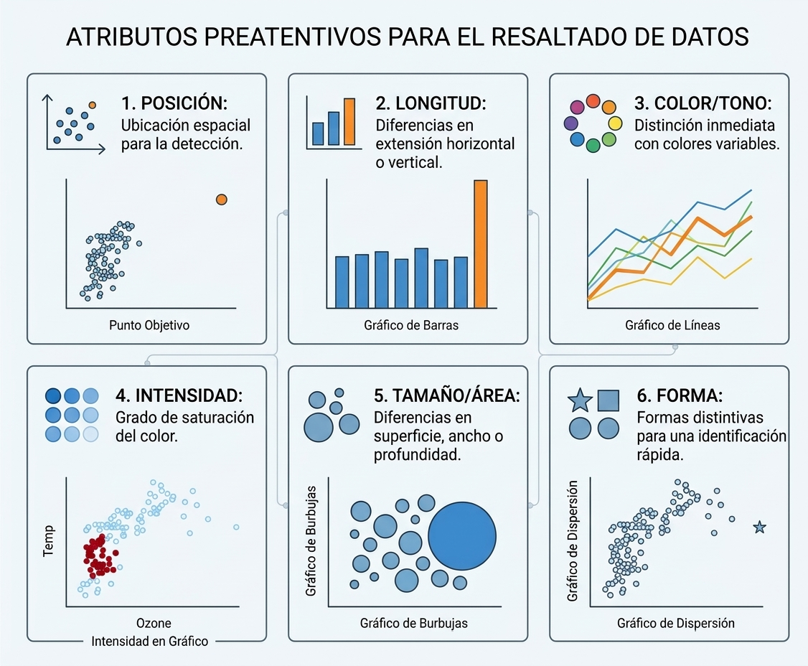

# Visualización de Datos, Gramática de Gráficos y Data Storytelling

## Fundamentos de la Visualización y Psicología Perceptiva

En la minería de datos y la Inteligencia de Negocios, la visualización no es un accesorio estético al final del análisis, sino una herramienta cognitiva fundamental para la exploración, el diagnóstico y la comunicación de hallazgos [@shmueli2018]. La mente humana procesa patrones visuales (formas, colores, posiciones y tendencias) de manera infinitamente más rápida e intuitiva que al inspeccionar tablas numéricas no estructuradas [@few2009]. Una representación gráfica bien concebida permite revelar estructuras ocultas, identificar agrupamientos naturales y detectar anomalías complejas de un vistazo [@tan2019].

La ciencia de la visualización se nutre de la interacción entre la **psicología perceptiva**, la **estadística** y el **diseño gráfico** [@cleveland1993]. Al diseñar gráficos analíticos, el objetivo primario debe ser minimizar la **carga cognitiva innecesaria**, permitiendo que la audiencia dedique su capacidad mental a interpretar el mensaje de negocio en lugar de descifrar la mecánica del gráfico [@few2009; @tufte2001]. Asimismo, se debe cuidar el ratio dato-tinta (*data-ink ratio*) formulado por Edward Tufte y evitar la "sopa de espagueti" (*rainbow spaghetti*), caracterizada por el uso descontrolado de colores y elementos sin jerarquía [@tufte2001; @abbott2024].

### Atributos Pre-atentivos
Los atributos pre-atentivos son propiedades visuales que el cerebro humano procesa de forma subconsciente e instantánea en menos de 250 milisegundos, antes de que ocurra la atención consciente [@few2009; @knaflic2015]. Al construir gráficos analíticos, el diseñador debe apalancarse en cuatro categorías de atributos pre-atentivos para guiar la mirada del espectador [@few2009]:

* **Posición Espacial:** El atributo más preciso para la estimación cuantitativa de magnitudes (ejes X e Y) [@cleveland1993].
* **Forma y Tamaño:** Longitud de barras, área de puntos o símbolos diferenciados para indicar categorías o volúmenes [@few2009].
* **Color (Tono e Intensidad):** Utilizado para destacar un dato crítico (*takeaway*) o representar gradientes continuos [@knaflic2015].
* **Movimiento y Transparencia (`alpha`):** Para diferenciar capas de información o mitigar el traslape de puntos en gráficos densos [@shmueli2018].

Aplicar estratégicamente los atributos pre-atentivos permite crear contraste visual, recordando la regla fundamental de Knaflic: *"Si todo resalta, nada resalta"* [@knaflic2015].

### Leyes de la Gestalt Aplicadas a Gráficos
La psicología de la Gestalt describe cómo la mente humana organiza elementos visuales individuales en un todo estructurado [@few2009]. En el diseño de gráficos y tableros, destacan seis principios esenciales [@few2009; @knaflic2015]:

1. **Proximidad:** Los objetos que están físicamente cerca se perciben como parte de un mismo grupo (ej. barras agrupadas en un histograma).
2. **Semejanza (Similitud):** Los elementos que comparten atributos de color, forma o tamaño se perciben como pertenecientes a la misma categoría.
3. **Encierro (Cierre):** Las áreas delimitadas por un fondo de color o borde suave se perciben como una unidad temática separada.
4. **Conexión:** Los puntos unidos por una línea continua se perciben como una secuencia o serie coherente (ej. gráficos de líneas temporales).
5. **Continuidad:** La mirada sigue naturalmente la trayectoria más suave a lo largo de un eje o curva.
6. **Figura-Fondo:** El cerebro distingue automáticamente el sujeto principal del fondo, lo que exige eliminar cuadrículas oscuras y fondos recargados para optimizar el *data-ink ratio* [@tufte2001].



## Guía Taxonómica de Tipos de Visualización (*Chart Chooser*)

Seleccionar el tipo de gráfico adecuado depende de la naturaleza de las variables y del objetivo analítico de la comunicación [@knaflic2015; @abbott2024].

### 1. Comparación y Categorías

* **Barras Horizontales o Verticales:** La herramienta más versátil para comparar magnitudes entre categorías discretas [@knaflic2015]. Las barras horizontales son ideales cuando los nombres de las categorías son largos [@abbott2024].
* **Barras Apiladas y 100% Apiladas:** Permiten comparar totales generales y la composición relativa por subgrupos [@knaflic2015].
* **Gráfico de Cascada (*Waterfall Chart*):** Excelente para mostrar cómo un valor inicial aumenta o disminuye secuencialmente a través de factores intermedios [@knaflic2015; @knaflic2020].

### 2. Tendencia y Series de Tiempo

* **Gráficos de Líneas:** La elección estándar para visualizar la evolución continua de métricas a lo largo del tiempo [@knaflic2015; @shmueli2018].
* **Gráficos de Pendiente (*Slopegraph*):** Muy útiles para comparar la variación de múltiples categorías entre dos puntos en el tiempo [@knaflic2015].

### 3. Distribución

* **Histogramas y Curvas de Densidad:** Para evaluar la forma, simetría y modas de distribuciones cuantitativas continuas [@shmueli2018; @pimpler2018].
* **Gráficos de Caja (*Boxplots*) y Violín:** Ideales para comparar la dispersión, la mediana, los cuartiles y los valores atípicos entre grupos [@shmueli2018; @pimpler2018].

### 4. Relación y Correlación

* **Gráficos de Dispersión (*Scatterplots*):** Evalúan la relación bivariante entre dos variables continuas, permitiendo identificar tendencias y anomalías [@shmueli2018].
* **Mapas de Calor (*Heatmaps*):** Mapean matrices de intensidad o correlación utilizando graduaciones de color [@shmueli2018; @johnson2014].

### 5. Composición y Parte de un Todo

* **Gráficos de Rosca (*Donut Chart*) y Waffle:** Alternativas preferibles al gráfico de pastel tradicional, recomendando limitar las categorías a un máximo de 2 o 3 [@knaflic2015; @abbott2024].

## Principios de Diseño, Audiencia y Data Storytelling

El **Data Storytelling** es el arte de estructurar los hallazgos analíticos dentro de una narrativa coherente y persuasiva, conectando los datos con las decisiones estratégicas de la organización [@knaflic2015]. Un gráfico aislado muestra *qué* ocurrió; el Data Storytelling explica *por qué* importa y *qué acción* se debe tomar al respecto [@provost2013; @knaflic2020].

### La Audiencia 

Un error recurrente al construir gráficos, tableros y reportes es enfocarse únicamente en la disponibilidad de los datos o en la complejidad técnica de las herramientas [@abbott2024]. Como enfatizan Desireé Abbott y Cole Nussbaumer Knaflic, **el éxito de una visualización no se mide por su sofisticación, sino por la comprensión y acción de su audiencia** [@knaflic2015; @abbott2024].

> *"Lo más importante que debes tener en cuenta al crear una visualización es conocer a tu audiencia. Todo gira en torno a ellos. Puedes crear la visualización más hermosa utilizando las últimas técnicas, pero si no satisface las necesidades de tu audiencia y ellos no comprenden el mensaje, habrás perdido tu tiempo por completo."*  
> — Desireé Abbott (*Everyday Data Visualization*, 2024) [@abbott2024]

Para colocar a la audiencia en el centro de la historia, el analista debe responder cuatro preguntas clave antes de trazar el primer gráfico [@knaflic2015]:

1. **¿Quién** es la audiencia específica y cuál es su nivel de conocimiento técnico?
2. **¿Qué** le preocupa o qué problema de negocio necesita resolver?
3. **¿Cómo** respaldan los datos la solución propuesta?
4. **¿Qué acción concreta** debe tomar tras ver la presentación o tablero?

### Adaptación por Perfil de Usuario
Al diseñar historias visuales, se deben diferenciar dos perfiles de audiencia principales [@abbott2024; @erl2016]:

* **Audiencia Ejecutiva (Alta Gerencia):** Dispone de tiempo limitado y requiere una comprensión inmediata del estado estratégico y financiero de la organización. Para este grupo, se deben priorizar las **Tarjetas de KPIs** (*KPI Cards*) con números principales de gran tamaño (*BANs - Big-Ass Numbers*), acompañados de contexto comparativo directo (variación % respecto a metas, periodos anteriores o semáforos de estado).
* **Audiencia Operativa y Analítica:** Requiere capacidades de exploración interactiva, filtrado dinámico y profundización (*drill-down*) para investigar las causas raíz de las desviaciones operativas.
* **Audiencia Académica, Científica y Técnica:** Exige el máximo rigor metodológico, la reproducibilidad del análisis y la validez estadística. Para este grupo, la visualización debe incorporar intervalos de confianza, medidas de dispersión, pruebas de hipótesis, la especificación de supuestos y la documentación completa de las fuentes de datos.
* **Público en General, Sociedad Civil y Clientes (Divulgación y Comunicación Pública):** Presenta una diversidad heterogénea en alfabetización de datos (*data literacy*) [@abbott2024]. Requiere la máxima reducción de la carga cognitiva y de la jerga técnica, priorizando la claridad narrativa, metáforas o analogías intuitivas, elementos visuales de alto impacto y un enfoque centrado en las implicaciones sociales o personales del hallazgo.

## KPIs y Diseño de Dashboards

En el entorno operativo de la Inteligencia de Negocios, la información consolidada se consume principalmente a través de **cuadros de mando o Dashboards**. Un dashboard es una interfaz gráfica de monitoreo que sintetiza múltiples fuentes de datos para evaluar el estado de una organización en tiempo real o en intervalos periódicos [@erl2016].

### Indicadores Clave de Rendimiento (KPIs)

El corazón de un dashboard reside en los **KPIs** (*Key Performance Indicators*), métricas cuantificables que miden el nivel de desempeño de un proceso crítico de negocio. Para que un KPI sea numéricamente informativo, no debe presentarse como un valor aislado; debe acompañarse de contexto comparativo:

* **Tarjetas de KPI (*KPI Cards*):** Muestran la métrica principal resaltada en tipografía de gran tamaño.
* **Contexto Comparativo:** Inclusión de metas objetivo (*targets*), variaciones porcentuales respecto al período anterior y tendencias históricas breves.

```
  ┌──────────────────────────────────────────────┐
  │  INGRESOS MENSUALES                         │
  │  $ 124,500 BOB                              │
  │  ▲ +12.5% vs. Mes Anterior | Meta: $ 115,000 │
  │  📈 ────────/\─/──                           │
  └──────────────────────────────────────────────┘
```

### Principios de Maquetación y la Regla de Shneiderman

El diseño de un dashboard debe seguir un principio de estructuración visual jerárquica. Para guiar al usuario sin abrumarlo, se aplica el paradigma de Ben Shneiderman (*Visual Information-Seeking Mantra*):

> *"Overview first, zoom and filter, then details-on-demand."* (Visión general primero, zoom y filtrado, luego detalles bajo demanda).

1. **Nivel Superior (Visión General):** Tarjetas de KPIs estratégicos situados en la parte superior del tablero.
2. **Nivel Medio (Zoom y Filtrado):** Gráficos de tendencias temporales y comparaciones regionales equipados con filtros interactivos (selectores de fecha, sucursal o categoría).
3. **Nivel Inferior (Detalles bajo Demanda):** Tablas detalladas o componentes de desglose a los que el usuario accede únicamente cuando requiere investigar una anomalía.

### Ecosistema de Herramientas de Visualización

Actualmente existe una amplia variedad de plataformas para la construcción de soluciones visuales, las cuales se clasifican según su flexibilidad y nivel de código:

* **Hojas de Cálculo (Excel, Google Sheets):** Accesibles y ubicuas, idóneas para análisis ad-hoc y gráficos simples.
* **Plataformas de Business Intelligence (Power BI, Tableau, Spotfire):** Diseñadas para la gestión empresarial masiva, modelado multidimensional y dashboards interactivos no programados.
* **Lenguajes de Programación y Código Reproducible (R, Python, D3.js):** Ofrecen máxima flexibilidad, auditabilidad completa e integración nativa con flujos de minería de datos y ciencia de datos.

## Implementación en R: De `ggplot2` a Dashboards Web

El ecosistema de R destaca por su capacidad para llevar análisis estadísticos y modelos de minería directamente a reportes y tableros interactivos.

### La Gramática de Gráficos con `ggplot2`

La librería `ggplot2` implementa la teoría de la **Gramática de Gráficos** formulada por Leland Wilkinson [@wilkinson2005; @wickham2016]. Bajo este paradigma, un gráfico no es una figura estática monolítica, sino la superposición secuencial de **capas independientes** vinculadas mediante el operador `+` [@wickham2016]:

1. **Data:** El dataset estructurado en formato data frame o tibble.
2. **Aesthetics (`aes`):** Mapeo de variables del dataset a propiedades visuales (ejes `x`, `y`, `color`, `fill`, `size`, `shape`).
3. **Geometries (`geom_*`):** La representación física de los datos (puntos, líneas, barras, cajas).
4. **Statistics (`stat_*`):** Transformaciones estadísticas integradas (conteo de frecuencias, suavizado de regresión).
5. **Scales (`scale_*`):** Control del rango y mapeo de ejes numéricos o paletas cromáticas.
6. **Facets (`facet_*`):** División del gráfico en múltiples paneles según categorías.
7. **Theme (`theme_*`):** Personalización estética no asociada a los datos (tipografía, colores de fondo, leyendas).

::: {.panel-tabset}

### Comparativa: R Base vs. ggplot2
Sintaxis para construir un gráfico de dispersión con línea de tendencia en R Base y `ggplot2`:

```r
# Cargar librerías
library(ggplot2)

# 1. R Base
plot(iris$Petal.Length, iris$Petal.Width, 
     col = iris$Species, pch = 19,
     xlab = "Longitud del Pétalo", ylab = "Ancho del Pétalo",
     main = "R Base: Relación Bi-variante")
abline(lm(Petal.Width ~ Petal.Length, data = iris), col = "black", lty = 2)

# 2. ggplot2 (Estructura por Capas)
ggplot(data = iris, aes(x = Petal.Length, y = Petal.Width, color = Species)) +
  geom_point(size = 2.5, alpha = 0.8) +
  geom_smooth(method = "lm", se = FALSE, color = "black", linetype = "dashed") +
  labs(title = "ggplot2: Mapeo Estético y Regresión",
       x = "Longitud del Pétalo", y = "Ancho del Pétalo") +
  theme_minimal()
```

### Visualizaciones Multivariantes
Uso de facetas (`facet_wrap`) y matrices de correlación (`GGally` y `corrplot`):

```r
library(ggplot2)
library(GGally)
library(corrplot)

# 1. Paneles Múltiples por Categoría (Facetting)
ggplot(iris, aes(x = Sepal.Length, y = Sepal.Width, color = Species)) +
  geom_point() +
  facet_wrap(~ Species) +
  theme_bw()

# 2. Matriz de Dispersión Multivariante
ggpairs(iris, columns = 1:4, aes(color = Species, alpha = 0.5))

# 3. Matriz de Correlación Gráfica
cor_mat <- cor(iris[, 1:4])
corrplot(cor_mat, method = "ellipse", type = "upper")
```

### Dashboards con `flexdashboard`

Estructura en R Markdown / Quarto para generar un dashboard HTML estático optimizado para la web:

https://rstudio.github.io/flexdashboard/


### Aplicaciones Interactivas con `shiny`
Prototipo básico de una aplicación web reactiva con interfaz de usuario (UI) y servidor (Server):

```r
library(shiny)
library(ggplot2)

# 1. Interfaz de Usuario (UI)
ui <- fluidPage(
  titlePanel("Explorador Reactivo de Datos"),
  sidebarLayout(
    sidebarPanel(
      selectInput("var_x", "Seleccione Variable X:", choices = names(iris)[1:4]),
      selectInput("var_y", "Seleccione Variable Y:", choices = names(iris)[1:4])
    ),
    mainPanel(
      plotOutput("grafico_reactivo")
    )
  )
)

# 2. Lógica del Servidor (Server)
server <- function(input, output) {
  output$grafico_reactivo <- renderPlot({
    ggplot(iris, aes_string(x = input$var_x, y = input$var_y, color = "Species")) +
      geom_point(size = 3) +
      theme_minimal()
  })
}

# 3. Ejecutar Aplicación
# shinyApp(ui = ui, server = server)
```
:::

## Cápsula de Ejercicios

::: {.callout-tip}
### Ejercicios de Aplicación Práctica (Para portafolio de clase)

1. **Gráfico Estilizado de Storytelling con `ggplot2`:** Con el dataset `iris`, construya un gráfico de dispersión entre `Sepal.Length` y `Petal.Length`. Resalte únicamente los puntos de la especie *Setosa* en azul brillante y atenúe las demás especies en gris claro. Añada un título narrativo orientado a la acción y elimine el ruido visual del fondo.
2. **Estructuración de un Dashboard con `flexdashboard`:** Cree un archivo `.Rmd` o `.qmd` con plantilla `flexdashboard`. Incluya dos tarjetas de valores (`valueBox`) con métricas clave y dos gráficos de `ggplot2` dispuestos en columnas paralelas para el análisis de la discriminación según la última encuesta a hogares disponible.
3. **Prototipo Reactivo en `shiny`:** Desarrolle una aplicación de `shiny` que permita al usuario seleccionar dinámicamente mediante un control desplegable (`selectInput`) qué departamento explorar respecto el perfil de los emigrantes en Bolivia según el censo 2024.
:::
